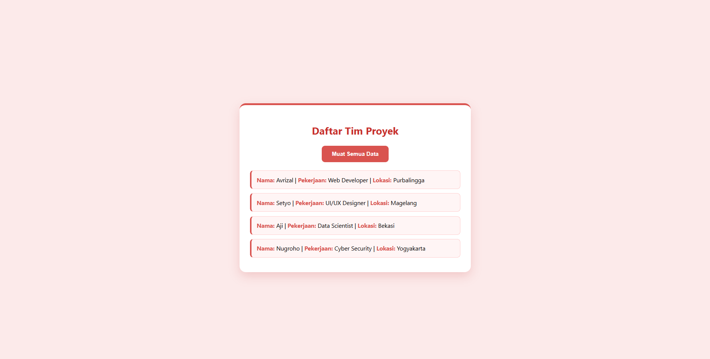

<div align="center">
  <br />
  <h1>LAPORAN PRAKTIKUM <br>APLIKASI BERBASIS PLATFORM</h1>
  <br />
  <h3>Modul 10<br>AJAX</h3>
  <br />
  <br />
  
  <br />
  <br />
  <h3>Disusun Oleh :</h3>
  <p>
    <strong>Avrizal Setyo Aji Nugroho</strong><br>
    <strong>2311102145</strong><br>
    <strong>S1 IF-11-REG01</strong>
  </p>
  <br />
  <br />
  <h3>Dosen Pengampu :</h3>
  <p>
    <strong>Dimas Fanny Hebrasianto Permadi, S.ST., M.Kom</strong>
  </p>
  <br />
  <br />
  <h4>Asisten Praktikum :</h4>
  <strong>Apri Pandu Wicaksono</strong> <br>
  <strong>Rangga Pradarrell Fathi</strong>
  <br />
  <h3>LABORATORIUM HIGH PERFORMANCE
 <br>FAKULTAS INFORMATIKA <br>UNIVERSITAS TELKOM PURWOKERTO <br>2026</h3>
</div>

---

## 1. Dasar Teori

AJAX (Asynchronous JavaScript and XML) adalah teknik pengembangan web yang memungkinkan pertukaran data antara client dan server di latar belakang, sehingga sebagian isi halaman web dapat diperbarui secara dinamis tanpa harus melakukan pemuatan ulang (reload) secara keseluruhan. Dengan memanfaatkan objek XMLHttpRequest atau Fetch API modern, JavaScript mengirimkan permintaan ke server (seperti file PHP), menerima respon yang biasanya berformat JSON, lalu memanipulasi DOM untuk menampilkan data tersebut secara instan. Hal ini menciptakan pengalaman pengguna yang lebih cepat, interaktif, dan efisien dalam penggunaan bandwidth karena server hanya perlu mengirimkan data mentah alih-alih seluruh struktur kode HTML.

---

## 2. Penjelasan Kode PHP dan HTML

---

### Kode PHP (`data.php`)

```php
<?php
header('Content-Type: application/json');

// Array multi-dimensi untuk menyimpan banyak data
$data_pengguna = [
    ['nama' => 'Avrizal', 'pekerjaan' => 'Web Developer', 'lokasi' => 'Purbalingga'],
    ['nama' => 'Setyo', 'pekerjaan' => 'UI/UX Designer', 'lokasi' => 'Magelang'],
    ['nama' => 'Aji', 'pekerjaan' => 'Data Scientist', 'lokasi' => 'Bekasi'],
    ['nama' => 'Nugroho', 'pekerjaan' => 'Cyber Security', 'lokasi' => 'Yogyakarta']
];

echo json_encode($data_pengguna);

```

---

### Kode HTML (`index.html`)

```html
<!DOCTYPE html>
<html lang="id">
  <head>
    <meta charset="UTF-8" />
    <meta name="viewport" content="width=device-width, initial-scale=1.0" />
    <title>Tugas AJAX - Avrizal Setyo Aji Nugroho</title>
    <style>
      body {
        font-family: "Segoe UI", sans-serif;
        background-color: #fceaea;
        /* Latar belakang merah sangat muda */
        margin: 0;
        display: flex;
        justify-content: center;
        align-items: center;
        min-height: 100vh;
        padding: 20px;
      }

      .container {
        background: white;
        padding: 25px;
        border-radius: 15px;
        box-shadow: 0 10px 25px rgba(180, 0, 0, 0.15);
        /* Bayangan kemerahan */
        text-align: center;
        width: 100%;
        max-width: 500px;
        border-top: 5px solid #d9534f;
        /* Garis atas merah */
      }

      h2 {
        color: #c9302c;
        /* Judul merah gelap */
        margin-bottom: 20px;
      }

      button {
        background-color: #d9534f;
        /* Tombol merah */
        color: white;
        border: none;
        padding: 12px 24px;
        border-radius: 8px;
        font-weight: bold;
        cursor: pointer;
        margin-bottom: 20px;
        transition: 0.3s;
      }

      button:hover {
        background-color: #c9302c;
        /* Merah lebih gelap saat hover */
        box-shadow: 0 4px 8px rgba(0, 0, 0, 0.2);
      }

      .item-profil {
        text-align: left;
        background: #fff5f5;
        /* Background item merah pucat */
        border: 1px solid #ffcccc;
        padding: 12px;
        margin-bottom: 10px;
        border-radius: 8px;
        font-size: 14px;
        border-left: 4px solid #d9534f;
        /* Aksen garis kiri merah */
      }

      .highlight {
        color: #d9534f;
        font-weight: bold;
      }

      #hasil-profil em {
        color: #999;
      }
    </style>
  </head>

  <body>
    <div class="container">
      <h2>Daftar Tim Proyek</h2>
      <button id="btn-tampilkan">Muat Semua Data</button>

      <div id="hasil-profil"></div>
    </div>

    <script>
      document
        .getElementById("btn-tampilkan")
        .addEventListener("click", function () {
          const wadah = document.getElementById("hasil-profil");
          wadah.innerHTML = "<em>Sedang mengambil data...</em>";

          fetch("data.php")
            .then((response) => {
              if (!response.ok) throw new Error("Gagal");
              return response.json();
            })
            .then((data) => {
              wadah.innerHTML = ""; // Bersihkan teks loading

              data.forEach((user) => {
                const divUser = document.createElement("div");
                divUser.className = "item-profil";
                divUser.innerHTML = `
                            <span class="highlight">Nama:</span> ${user.nama} | 
                            <span class="highlight">Pekerjaan:</span> ${user.pekerjaan} | 
                            <span class="highlight">Lokasi:</span> ${user.lokasi}
                        `;
                wadah.appendChild(divUser);
              });
            })
            .catch((error) => {
              wadah.innerHTML =
                "<span style='color:red;'>Terjadi kesalahan koneksi.</span>";
            });
        });
    </script>
  </body>
</html>
```

---

### Hasil Tampilan (Screenshot)




---

### Penjelasan Kode

## 1. Penjelasan File `data.php` (Server-Side)

File ini berfungsi sebagai penyedia data (API) dalam format JSON agar bisa dikonsumsi oleh JavaScript.

- **`header('Content-Type: application/json');`** Baris ini sangat penting untuk memberi tahu browser bahwa data yang dikirimkan adalah format **JSON**, sehingga JavaScript dapat mengenalinya sebagai objek, bukan sekadar teks biasa.
- **`$data_pengguna = [...]`** Merupakan variabel yang menampung **Array Multi-dimensi**. Di dalamnya terdapat kumpulan array asosiatif yang berisi data statis (Nama, Pekerjaan, Lokasi).
- **`echo json_encode($data_pengguna);`** Fungsi ini mengubah (encoding) array PHP menjadi string format **JSON**. Inilah data yang nantinya akan "dijemput" oleh fungsi `fetch()` di sisi client.

---

## 2. Penjelasan File `index.html` (Client-Side)

File ini menangani tampilan (UI) dan logika pengambilan data tanpa _reload_ halaman menggunakan AJAX.

### A. CSS (Styling)

- **Flexbox Layout**: Properti `display: flex`, `justify-content: center`, dan `align-items: center` pada `body` digunakan untuk membuat seluruh konten berada tepat di **tengah layar** secara vertikal dan horizontal.
- **Red Theme**: Penggunaan warna `#d9534f` (merah) pada tombol dan border memberikan konsistensi desain yang tegas.
- **`.item-profil`**: Class ini memberikan gaya pada setiap baris data yang muncul secara dinamis, termasuk penambahan `border-left` merah agar setiap data terlihat seperti kartu terpisah.

### B. JavaScript (Fetch API / AJAX)

- **`document.getElementById('btn-tampilkan').addEventListener('click', ...)`** Berfungsi untuk memicu (trigger) fungsi pengambilan data tepat saat pengguna mengklik tombol.
- **`fetch('data.php')`** Fungsi utama AJAX modern untuk mengambil data dari server secara _asynchronous_ (di latar belakang).
- **`.then(response => response.json())`** Setelah server merespon, baris ini mengubah data JSON yang diterima menjadi **Objek JavaScript** agar properti seperti `user.nama` bisa diakses.
- **`data.forEach(user => { ... })`** Karena data yang diterima lebih dari satu, fungsi ini melakukan perulangan (looping) untuk memproses setiap data pengguna satu per satu.
- **`document.createElement('div')` & `appendChild()`** Digunakan untuk membuat elemen HTML baru secara dinamis melalui JavaScript dan memasukkannya ke dalam div `#hasil-profil` tanpa perlu menulis kode HTML secara manual untuk setiap data.
- **`.catch(error => ...)`** Berfungsi sebagai pengaman (error handling) jika terjadi kegagalan koneksi atau file `data.php` tidak ditemukan.

---

## 7. Referensi

- [W3Schools - AJAX Introduction](https://www.w3schools.com/xml/ajax_intro.asp)
- [MDN Web Docs - Fetch API](https://developer.mozilla.org/en-US/docs/Web/API/Fetch_API)
- [JavaScript.info - Fetch](https://javascript.info/fetch)
