<div align="center">
  <br />
  <h1>LAPORAN PRAKTIKUM <br> APLIKASI BERBASIS PLATFORM</h1>
  <br />
  <h3>TUGAS COTS 2 PRAKTIKUM<br>SISTEM DATA MAHASISWA (CRUD)</h3>
  <br />
  <p align="center">
    
  </p>
  <br />
  <h3>Disusun Oleh :</h3>
  <p>
    <strong>Avrizal Setyo Aji Nugroho</strong><br>
    <strong>2311102145</strong><br>
    <strong>S1 IF-11-REG01</strong>
  </p>
  <br />
  <h3>Dosen Pengampu :</h3>
  <p><strong>Dimas Fanny Hebrasianto Permadi, S.ST., M.Kom</strong></p>
  <br />
  <h4>Asisten Praktikum :</h4>
  <strong>Apri Pandu Wicaksono </strong> <br>
  <strong>Rangga Pradarrell Fathi</strong>
  <br />
  <h3>LABORATORIUM HIGH PERFORMANCE <br>FAKULTAS INFORMATIKA <br>UNIVERSITAS TELKOM PURWOKERTO <br>2026</h3>
</div>

<hr>

### 1. Dasar Teori

# Dasar Teori

- **CRUD (Create, Read, Update, Delete)** adalah konsep dasar dalam pengolahan data yang mencakup proses menambah, menampilkan, memperbarui, dan menghapus data.

- **Node.js** adalah lingkungan runtime JavaScript yang digunakan untuk menjalankan kode di sisi server.

- **Express.js** adalah framework pada Node.js yang digunakan untuk mempermudah pembuatan server dan pengelolaan routing aplikasi web.

- **EJS (Embedded JavaScript)** adalah template engine yang memungkinkan penyisipan kode JavaScript ke dalam HTML untuk menghasilkan halaman yang dinamis.

- **Bootstrap 5** adalah framework CSS yang digunakan untuk membangun tampilan antarmuka yang responsif dan modern.

- **jQuery** adalah library JavaScript yang digunakan untuk mempermudah manipulasi elemen HTML (DOM) dan interaksi pada halaman web.

- **DataTables** adalah plugin jQuery yang digunakan untuk menampilkan data dalam bentuk tabel interaktif dengan fitur seperti pencarian, pengurutan, dan pagination.

- **JSON (JavaScript Object Notation)** adalah format pertukaran data yang ringan dan mudah dibaca, yang digunakan untuk mengirim data antara server dan client.

### 2. Arsitektur Direktori Proyek

```text
TUGAS 2 PRAKTIKUM/
├── node_modules/         # Folder dependencies (Express, EJS, dll)
├── views/                # Folder template tampilan aplikasi (EJS)
│   ├── index.ejs         # Halaman Tabel (DataTables & JSON API)
│   ├── tambah.ejs        # Form Input Mahasiswa baru
│   └── edit.ejs          # Form Pembaruan Data Mahasiswa
├── app.js                # Server Utama (Routing & Logika CRUD)
├── package.json          # Manifest proyek & daftar library
└── README.md             # Dokumentasi Laporan Praktikum
```

### 3. Implementasi Kode Program

#### A. File `app.js` (Server & API JSON)

File ini mengelola simulasi database menggunakan array in-memory dan menyediakan endpoint API JSON.

```javascript
const express = require("express");
const app = express();
const bodyParser = require("body-parser");

app.set("view engine", "ejs");
app.use(bodyParser.urlencoded({ extended: true }));

// Data dummy sementara
let dataMahasiswa = [
  {
    id: 1,
    nama: "Avrizal Setyo Aji Nugroho",
    nim: "2311102145",
    kelas: "APLIKASI BERBASIS PLATFORM PS1IF-11-REG01",
  },
];

// Halaman Utama: Tabel Data
app.get("/", (req, res) => res.render("index"));

// Halaman Form: Input Data
app.get("/tambah", (req, res) => res.render("tambah"));

// Endpoint JSON: Wajib untuk DataTables
app.get("/api/data", (req, res) => res.json({ data: dataMahasiswa }));

// Proses Simpan Data (Create)
// Halaman Tambah
app.get("/tambah", (req, res) => {
  res.render("tambah"); // Render file tambah.ejs
});

// Halaman Edit (Ambil data dulu)
app.get("/edit/:id", (req, res) => {
  const data = dataMahasiswa.find((d) => d.id == req.params.id);
  res.render("edit", { data: data }); // Render file edit.ejs
});

// Route Simpan (Untuk Tambah)
app.post("/simpan", (req, res) => {
  const { nama, nim, kelas } = req.body;
  dataMahasiswa.push({ id: Date.now(), nama, nim, kelas });
  res.redirect("/");
});

// Route Update (Untuk Edit)
app.post("/update", (req, res) => {
  const { id, nama, nim, kelas } = req.body;
  const index = dataMahasiswa.findIndex((d) => d.id == id);
  dataMahasiswa[index] = { id: parseInt(id), nama, nim, kelas };
  res.redirect("/");
});

// Proses Hapus (Delete)
app.get("/hapus/:id", (req, res) => {
  dataMahasiswa = dataMahasiswa.filter((d) => d.id != req.params.id);
  res.redirect("/");
});

app.listen(3000, () =>
  console.log("Tugas 2 berjalan di http://localhost:3000"),
);
```

# Penjelasan Baris Kode `app.js`

- **Baris 1–3**: Mengimpor modul `express` untuk framework web dan `body-parser` untuk memproses data dari form HTML.

- **Baris 5–6**: Menetapkan EJS sebagai template engine dan mengaktifkan middleware untuk membaca data URL-encoded dari permintaan POST.

- **Baris 9–11**: Inisialisasi variabel `dataMahasiswa` sebagai penyimpanan data sementara di memori server (Array In-Memory).

- **Baris 14–17**: Mendefinisikan rute GET untuk menampilkan halaman utama (`index`) dan halaman formulir tambah data (`tambah`).

- **Baris 20**: Membuat endpoint API `/api/data` yang mengirimkan data mahasiswa dalam format JSON untuk kebutuhan jQuery DataTables.

- **Baris 23–31**: Menangani logika Edit; mencari data mahasiswa berdasarkan parameter ID dan mengirimkannya ke view `edit.ejs`.

- **Baris 34–39**: Menangani proses Simpan; mengekstrak data dari body request, memberikan ID unik via `Date.now()`, lalu menambahkannya ke array.

- **Baris 42–47**: Menangani proses Update; memperbarui record mahasiswa pada indeks array yang sesuai berdasarkan ID yang dikirimkan.

- **Baris 50–53**: Menangani proses Hapus; menyaring array untuk membuang data yang ID-nya cocok dengan parameter URL.

- **Baris 55–57**: Menjalankan server pada port 3000 dan menampilkan pesan konfirmasi di terminal.

#### B. File `views/index.ejs` (Halaman Tabel Utama)

Halaman ini mengintegrasikan plugin jQuery DataTables untuk menampilkan data dari server.

```html
<!DOCTYPE html>
<html lang="id">
  <head>
    <title>Tugas COTS 2 - Data Mahasiswa</title>
    <link
      rel="stylesheet"
      href="https://cdn.jsdelivr.net/npm/bootstrap@5.3.0/dist/css/bootstrap.min.css"
    />
    <link
      rel="stylesheet"
      href="https://cdn.datatables.net/1.13.4/css/jquery.dataTables.min.css"
    />

    <style>
      .dataTables_length select {
        background-color: #ffffff !important;
      }
      .dataTables_filter input {
        background-color: #ffffff !important;
      }
    </style>
  </head>

  <body class="bg-dark text-light">
    <div class="container mt-5">
      <div class="card shadow bg-dark text-white border-0">
        <div class="card-header bg-black text-white p-3">
          <h3 class="mb-0 text-center fw-bold">
            Tugas COTS 2: Daftar Mahasiswa
          </h3>
        </div>
        <div class="card-body">
          <a href="/tambah" class="btn btn-success fw-bold mb-3"
            >+ Tambah Data</a
          >

          <table
            id="tabelTugas"
            class="table table-light table-striped table-hover table-bordered border-dark"
          >
            <thead>
              <tr class="table-active">
                <th>Nama</th>
                <th>NIM</th>
                <th>Kelas</th>
                <th>Aksi</th>
              </tr>
            </thead>
          </table>
        </div>
      </div>
      <p class="text-center text-white-50 mt-3">
        <small
          >&copy; 2026 Tugas COTS 2 Praktikum - Avrizal Setyo Aji Nugroho</small
        >
      </p>
    </div>

    <script src="https://code.jquery.com/jquery-3.6.0.min.js"></script>
    <script src="https://cdn.datatables.net/1.13.4/js/jquery.dataTables.min.js"></script>
    <script>
      $(document).ready(function () {
        $("#tabelTugas").DataTable({
          ajax: "/api/data",
          columns: [
            { data: "nama" },
            { data: "nim" },
            { data: "kelas" },
            // Di dalam script DataTable, bagian columns:
            {
              data: "id",
              render: function (data) {
                return `
                            <a href="/edit/${data}" class="btn btn-warning btn-sm">Edit</a>
                            <a href="/hapus/${data}" class="btn btn-danger btn-sm" onclick="return confirm('Yakin hapus?')">Hapus</a>
                        `;
              },
            },
          ],
        });
      });
    </script>
  </body>
</html>
```

# Penjelasan Baris Kode `index.ejs`

Kode `index.ejs` diawali dengan inisialisasi dokumen HTML serta pemanggilan CDN Bootstrap 5 dan jQuery DataTables untuk mendukung tampilan dan fungsi tabel. Selanjutnya terdapat CSS tambahan untuk menyesuaikan tampilan komponen agar kontras dengan tema gelap. Struktur utama menggunakan card Bootstrap dengan latar belakang gelap dan judul terpusat, serta tombol navigasi menuju halaman `/tambah` untuk input data baru. Tabel didefinisikan dengan ID `tabelTugas` yang memuat kolom Nama, NIM, Kelas, dan Aksi, serta dilengkapi footer berisi informasi hak cipta. Library jQuery dan DataTables kemudian diaktifkan, diikuti inisialisasi DataTables yang mengambil data secara asynchronous dari endpoint `/api/data` dalam format JSON. Data tersebut dipetakan ke kolom tabel, dan pada kolom aksi digunakan fungsi render untuk menampilkan tombol Edit dan Hapus secara dinamis dengan konfirmasi sebelum penghapusan.

#### C. File `views/tambah.ejs` (Halaman Input)

Halaman formulir untuk registrasi data mahasiswa baru.

```html
<!DOCTYPE html>
<html lang="id">
  <head>
    <meta charset="UTF-8" />
    <meta name="viewport" content="width=device-width, initial-scale=1.0" />
    <title>Tugas COTS 2 - Tambah Data</title>
    <link
      rel="stylesheet"
      href="https://cdn.jsdelivr.net/npm/bootstrap@5.3.0/dist/css/bootstrap.min.css"
    />
  </head>

  <body class="bg-dark text-light">
    <div class="container mt-5">
      <div class="row justify-content-center">
        <div class="col-md-6">
          <div class="card shadow bg-secondary text-white border-0">
            <div class="card-header bg-black text-white p-3">
              <h4 class="mb-0 text-center fw-bold">Tambah Data Mahasiswa</h4>
            </div>
            <div class="card-body p-4">
              <form action="/simpan" method="POST">
                <div class="mb-3">
                  <label class="form-label fw-bold">Nama Lengkap</label>
                  <input
                    type="text"
                    name="nama"
                    class="form-control"
                    placeholder="Contoh: Avrizal Setyo"
                    required
                  />
                </div>

                <div class="mb-3">
                  <label class="form-label fw-bold">NIM</label>
                  <input
                    type="text"
                    name="nim"
                    class="form-control"
                    placeholder="Masukkan NIM Anda"
                    required
                  />
                </div>

                <div class="mb-3">
                  <label class="form-label fw-bold">Kelas</label>
                  <input
                    type="text"
                    name="kelas"
                    class="form-control"
                    placeholder="Contoh: APLIKASI BERBASIS PLATFORM PS1IF-11-REG01"
                    required
                  />
                </div>

                <div class="d-grid gap-2 mt-4">
                  <button type="submit" class="btn btn-success fw-bold">
                    Simpan Data
                  </button>
                  <a href="/" class="btn btn-outline-light">Batal / Kembali</a>
                </div>
              </form>
            </div>
          </div>
          <p class="text-center text-white mt-3">
            <small
              >&copy; 2026 Tugas COTS 2 Praktikum - Avrizal Setyo Aji
              Nugroho</small
            >
          </p>
        </div>
      </div>
    </div>

    <script src="https://cdn.jsdelivr.net/npm/bootstrap@5.3.0/dist/js/bootstrap.bundle.min.js"></script>
  </body>
</html>
```

# Penjelasan Baris Kode `tambah.ejs`

Kode `tambah.ejs` diawali dengan pendefinisian struktur dasar HTML5 serta pemanggilan Bootstrap 5 untuk mengatur tampilan formulir. Selanjutnya, body diatur menggunakan tema gelap dan sistem grid agar formulir berada di tengah halaman. Formulir dibungkus dalam komponen card dengan latar abu-abu dan header berwarna hitam sebagai judul. Tag `<form>` menggunakan metode POST yang mengarah ke rute `/simpan` untuk mengirim data ke server. Di dalamnya terdapat input untuk Nama, NIM (dengan validasi required), dan Kelas yang dilengkapi placeholder. Bagian akhir form menyediakan tombol Simpan dan Batal untuk navigasi. Di bawahnya terdapat informasi hak cipta, serta pemanggilan JavaScript Bootstrap untuk mendukung interaksi antarmuka.

#### D. File `views/edit.ejs` (Halaman Perbaruan)

Halaman formulir untuk memperbarui data mahasiswa berdasarkan ID

```html
<!DOCTYPE html>
<html lang="id">
  <head>
    <meta charset="UTF-8" />
    <meta name="viewport" content="width=device-width, initial-scale=1.0" />
    <title>Tugas COTS 2 - Edit Data</title>
    <link
      rel="stylesheet"
      href="https://cdn.jsdelivr.net/npm/bootstrap@5.3.0/dist/css/bootstrap.min.css"
    />
  </head>

  <body class="bg-dark text-light">
    <div class="container mt-5">
      <div class="row justify-content-center">
        <div class="col-md-6">
          <div class="card shadow bg-secondary text-white border-0">
            <div class="card-header bg-black text-white p-3">
              <h4 class="mb-0 text-center fw-bold">Edit Data Mahasiswa</h4>
            </div>
            <div class="card-body p-4">
              <form action="/update" method="POST">
                <input type="hidden" name="id" value="<%= data.id %>" />

                <div class="mb-3">
                  <label class="form-label fw-bold">Nama Lengkap</label>
                  <input
                    type="text"
                    name="nama"
                    class="form-control"
                    value="<%= data.nama %>"
                    required
                  />
                </div>

                <div class="mb-3">
                  <label class="form-label fw-bold">NIM</label>
                  <input
                    type="text"
                    name="nim"
                    class="form-control"
                    value="<%= data.nim %>"
                    required
                  />
                </div>

                <div class="mb-3">
                  <label class="form-label fw-bold">Kelas</label>
                  <input
                    type="text"
                    name="kelas"
                    class="form-control"
                    value="<%= data.kelas %>"
                    required
                  />
                </div>

                <div class="d-grid gap-2 mt-4">
                  <button type="submit" class="btn btn-warning fw-bold">
                    Update Data
                  </button>
                  <a href="/" class="btn btn-outline-light">Batal / Kembali</a>
                </div>
              </form>
            </div>
          </div>
          <p class="text-center text-white mt-3">
            <small
              >&copy; 2026 Tugas COTS 2 Praktikum - Avrizal Setyo Aji
              Nugroho</small
            >
          </p>
        </div>
      </div>
    </div>
  </body>
</html>
```

# Penjelasan Baris Kode `edit.ejs`

Kode `edit.ejs` diawali dengan inisialisasi struktur HTML5 dan pemanggilan Bootstrap 5 untuk pengaturan tampilan. Selanjutnya, halaman menggunakan tema gelap dengan komponen card sebagai wadah utama formulir edit. Formulir dibuka dengan metode POST yang diarahkan ke rute `/update` untuk memproses perubahan data. Terdapat input tersembunyi (`hidden`) untuk mengirimkan ID mahasiswa agar server dapat mengenali data yang akan diperbarui. Input untuk Nama, NIM, dan Kelas ditampilkan dengan fitur auto-fill menggunakan EJS berdasarkan data yang sudah ada, sehingga pengguna dapat langsung mengedit tanpa mengisi ulang dari awal. Di bagian akhir tersedia tombol Update dan Batal untuk aksi pengguna, serta informasi hak cipta ditampilkan di bawah formulir.

### 4. Hasil Program (Screenshot Output)

#### 1. Tampilan Awal Halaman

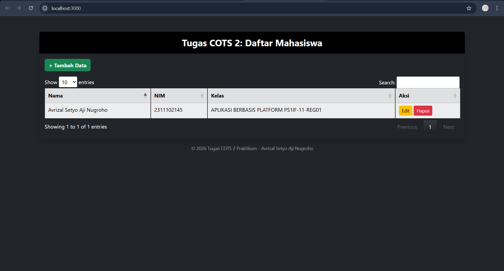

#### 2. Input Data & Data Berhasil Ditambahkan

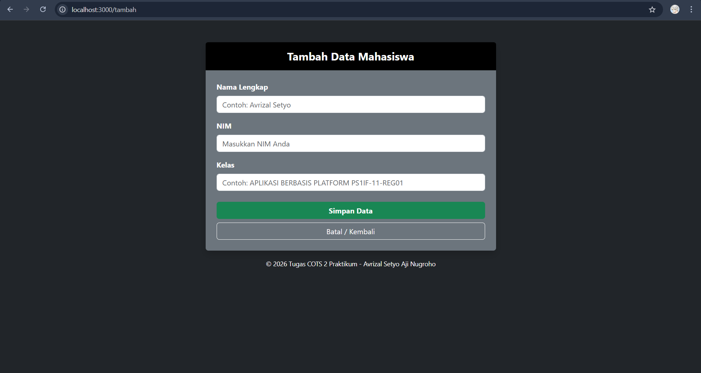
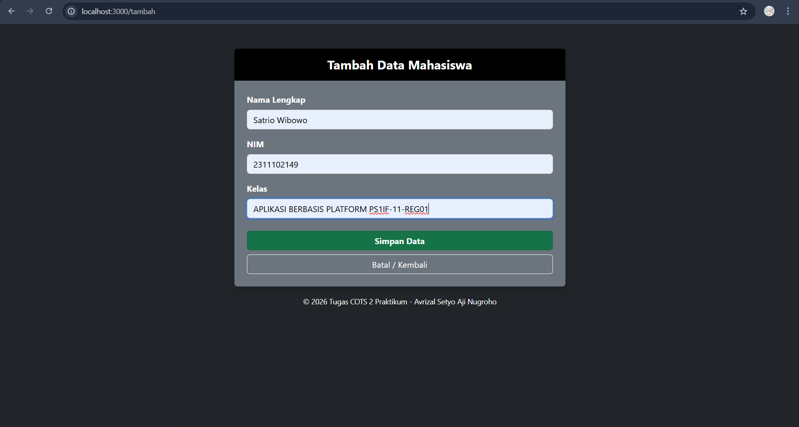
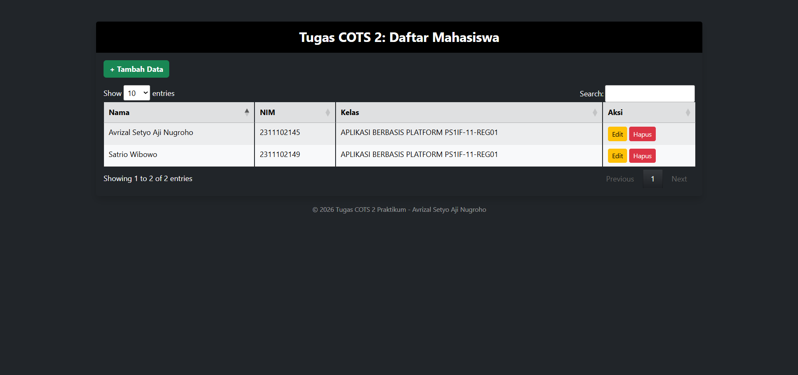

#### 3. Edit Data

Mengedit Ferguso ke Ferguso Smit
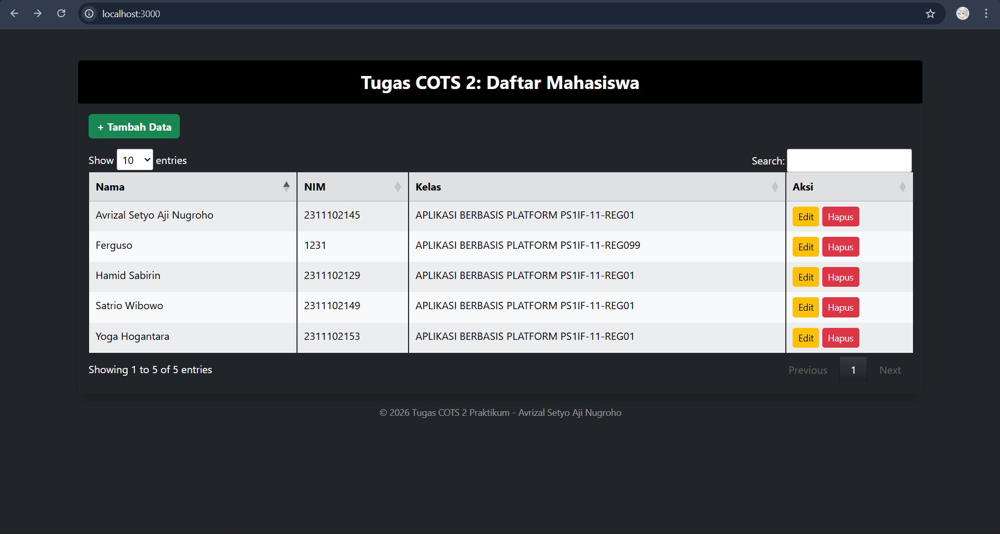
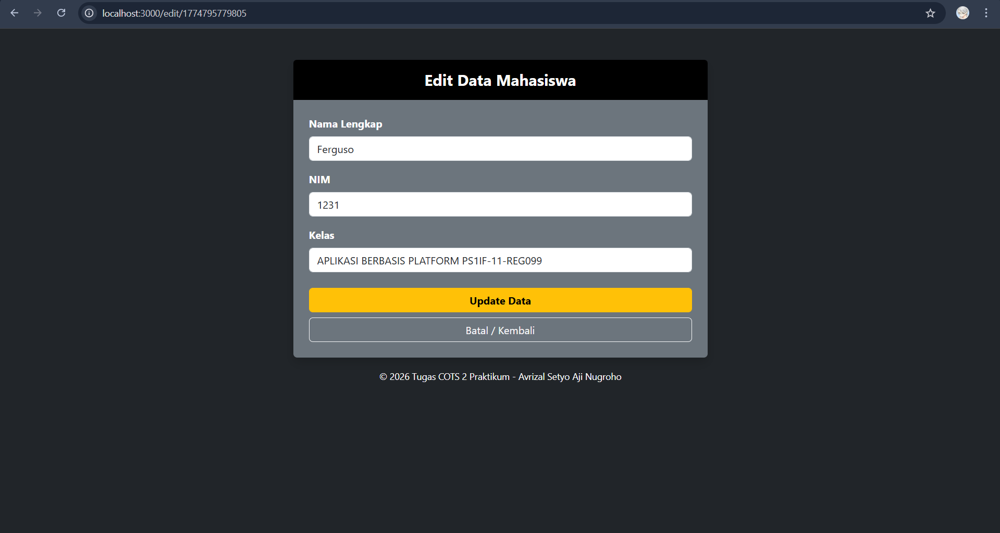
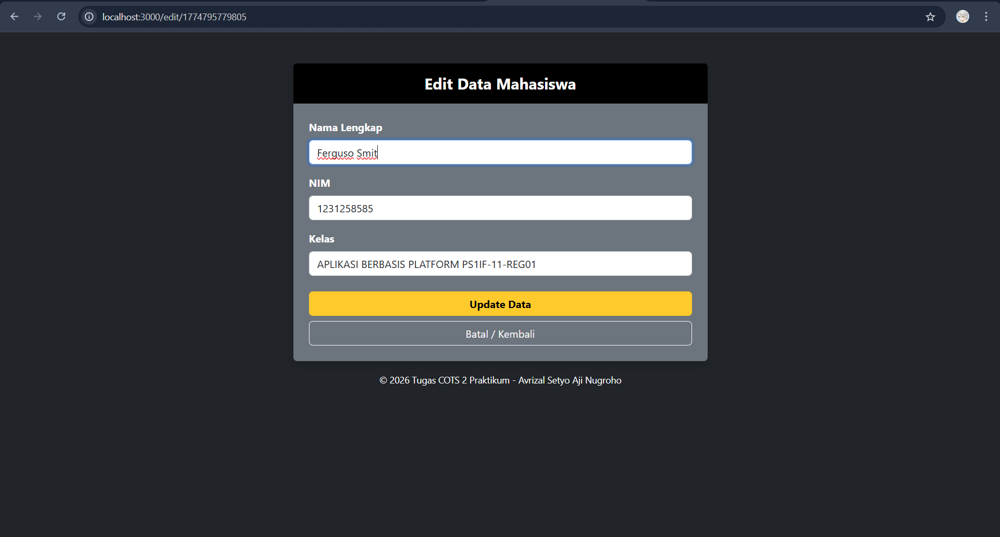
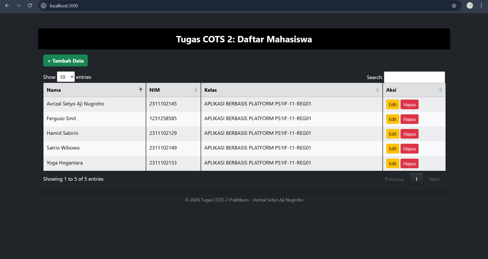

#### 4. Hapus Data

Menghapus ferguso smit
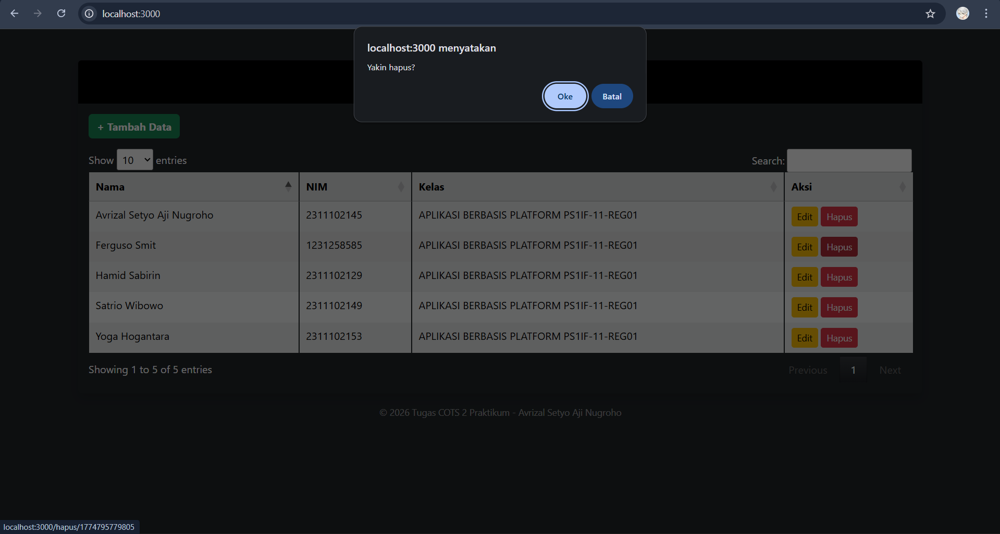
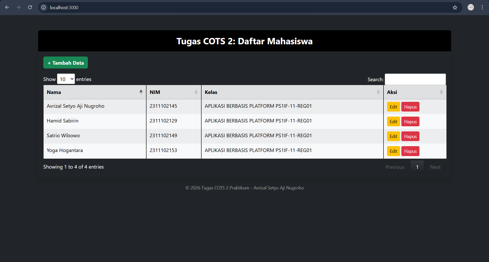

#### 5. Fitur Pencarian (Search)

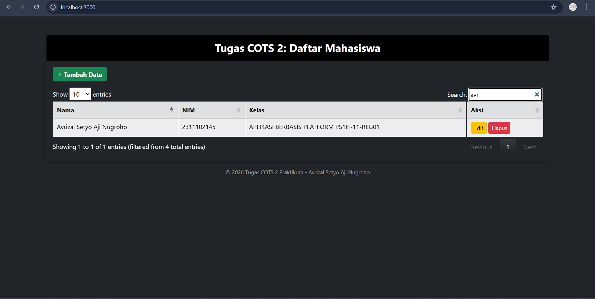

### 5. Link Video Presentasi

[Video Presentasi](https://drive.google.com/file/d/1eQN0jMSPQCYGTV3GT93EWSRCEUUu9Sh2/view?usp=sharing)
