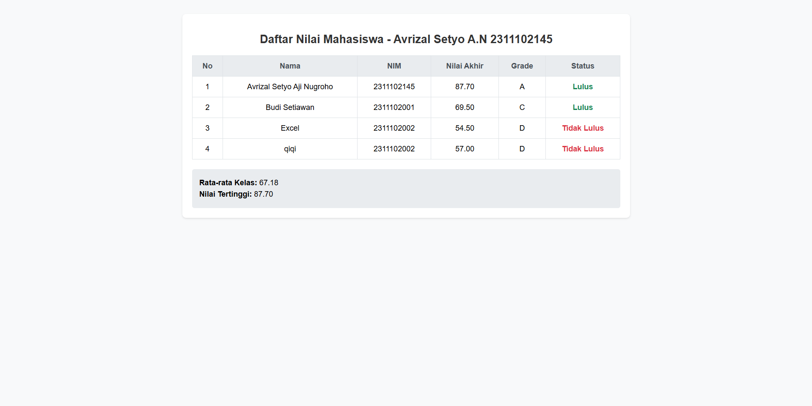

<div align="center">
  <br />
  <h1>LAPORAN PRAKTIKUM <br>APLIKASI BERBASIS PLATFORM</h1>
  <br />
  <h3>Modul 9<br>PHP</h3>
  <br />
  <br />
  
  <br />
  <br />
  <h3>Disusun Oleh :</h3>
  <p>
    <strong>Avrizal Setyo Aji Nugroho</strong><br>
    <strong>2311102145</strong><br>
    <strong>S1 IF-11-REG01</strong>
  </p>
  <br />
  <br />
  <h3>Dosen Pengampu :</h3>
  <p>
    <strong>Dimas Fanny Hebrasianto Permadi, S.ST., M.Kom</strong>
  </p>
  <br />
  <br />
  <h4>Asisten Praktikum :</h4>
  <strong>Apri Pandu Wicaksono</strong> <br>
  <strong>Rangga Pradarrell Fathi</strong>
  <br />
  <h3>LABORATORIUM HIGH PERFORMANCE
 <br>FAKULTAS INFORMATIKA <br>UNIVERSITAS TELKOM PURWOKERTO <br>2026</h3>
</div>

---

## 1. Dasar Teori

### A. Web Server

Web Server adalah sebuah perangkat lunak yang berjalan pada server dan bertugas untuk menangani permintaan (_request_) dari _client_ (seperti web browser) melalui protokol HTTP maupun HTTPS. Setelah memproses permintaan tersebut, web server akan mengirimkan kembali hasilnya (_response_) kepada _client_ dalam bentuk halaman web yang umumnya berbasis HTML.

Beberapa contoh perangkat lunak web server yang paling populer dan sering digunakan dalam pengembangan web antara lain:

1. Apache Web Server
2. Nginx
3. Internet Information Services (IIS)
4. LiteSpeed Web Server

### B. Server-Side Scripting

_Server-Side Scripting_ merupakan teknik atau teknologi pemrograman web di mana kode (skrip) diproses dan dieksekusi secara langsung di sisi server, bukan di sisi _browser_ pengguna. Teknologi ini sangat penting karena memungkinkan pengembang untuk merancang dan membangun halaman web yang dinamis, berinteraksi dengan _database_, dan mengelola _session_ pengguna secara efisien.

Beberapa bahasa pemrograman yang menggunakan konsep _Server-Side Scripting_ meliputi:

1. PHP (Hypertext Preprocessor)
2. Python
3. ASP.NET
4. Java Server Pages (JSP)
5. Ruby
6. Perl

### C. Pengenalan dan Keunggulan PHP

PHP (_Hypertext Preprocessor_) adalah salah satu bahasa pemrograman _server-side_ yang paling mendominasi dalam industri pengembangan website saat ini. PHP dirancang secara khusus untuk disisipkan ke dalam kode HTML dan sangat ideal untuk membangun aplikasi berbasis web.

Beberapa keistimewaan dan alasan utama mengapa PHP sangat populer digunakan adalah:

1. **Bebas Biaya (Open Source):** PHP dapat diunduh dan digunakan sepenuhnya secara gratis.
2. **Multi-Platform:** Sangat fleksibel karena dapat dijalankan di berbagai sistem operasi, seperti Windows, Linux, maupun macOS.
3. **Mudah Dipelajari:** Memiliki struktur dan sintaks dasar yang relatif ramah bagi _programmer_ pemula.
4. **Performa yang Cepat:** Eksekusi kode di sisi server tergolong ringan dan sangat responsif.
5. **Komunitas Besar:** Dukungan forum, tutorial, serta dokumentasi sangat melimpah di internet, sehingga memudahkan pencarian solusi jika terjadi _error_ atau kendala.
6. **Tingkat Keamanan yang Baik:** Memiliki pembaruan rutin untuk menambal celah keamanan dalam pengembangan aplikasi web.

---

## 2. Penjelasan Kode PHP

---

### Kode PHP (`index.php`)

```php
<?php

// Menghitung bobot: Tugas 30%, UTS 30%, UAS 40%
function hitungNilaiAkhir($tugas, $uts, $uas) {
    return ($tugas * 0.3) + ($uts * 0.3) + ($uas * 0.4);
}

// Menentukan Grade menggunakan If/Else
function tentukanGrade($nilai) {
    if ($nilai >= 85) {
        return "A";
    } elseif ($nilai >= 75) {
        return "B";
    } elseif ($nilai >= 60) {
        return "C";
    } elseif ($nilai >= 50) {
        return "D";
    } else {
        return "E";
    }
}

// Menentukan Status menggunakan operator perbandingan
function tentukanStatus($nilai) {
    return ($nilai >= 60) ? "Lulus" : "Tidak Lulus";
}

// --- DATA MAHASISWA (ARRAY ASOSIATIF) ---
$daftarMahasiswa = [
    [
        "nama"  => "Avrizal Setyo Aji Nugroho",
        "nim"   => "2311102145",
        "tugas" => 90,
        "uts"   => 85,
        "uas"   => 88
    ],
    [
        "nama"  => "Budi Setiawan",
        "nim"   => "2311102001",
        "tugas" => 75,
        "uts"   => 70,
        "uas"   => 65
    ],
    [
        "nama"  => "Excel",
        "nim"   => "2311102002",
        "tugas" => 55,
        "uts"   => 60,
        "uas"   => 50
    ],
    [
        "nama"  => "qiqi",
        "nim"   => "2311102002",
        "tugas" => 75,
        "uts"   => 55,
        "uas"   => 45
    ]

];

// Inisialisasi variabel untuk perhitungan statistik
$totalNilai = 0;
$nilaiTertinggi = 0;
$jumlahMahasiswa = count($daftarMahasiswa);

?>

<!DOCTYPE html>
<html lang="id">
<head>
    <meta charset="UTF-8">
    <title>Sistem Penilaian Mahasiswa</title>
    <style>
        body {
            font-family: Arial, sans-serif;
            margin: 30px;
            background-color: #f8f9fa;
        }
        h2 {
            text-align: center;
            color: #333;
        }
        .container {
            background-color: #fff;
            padding: 20px;
            border-radius: 8px;
            box-shadow: 0 2px 4px rgba(0,0,0,0.1);
            max-width: 900px;
            margin: auto;
        }
        table {
            border-collapse: collapse;
            width: 100%;
            margin-bottom: 20px;
        }
        th, td {
            border: 1px solid #dee2e6;
            padding: 12px;
            text-align: center;
        }
        th {
            background-color: #e9ecef;
            color: #495057;
        }
        .lulus {
            color: #198754;
            font-weight: bold;
        }
        .gagal {
            color: #dc3545;
            font-weight: bold;
        }
        .statistik {
            background-color: #e9ecef;
            padding: 15px;
            border-radius: 5px;
            font-size: 16px;
        }
        .statistik p {
            margin: 5px 0;
        }
    </style>
</head>
<body>

    <div class="container">
        <h2>Daftar Nilai Mahasiswa - Avrizal Setyo A.N 2311102145</h2>

        <table>
            <thead>
                <tr>
                    <th>No</th>
                    <th>Nama</th>
                    <th>NIM</th>
                    <th>Nilai Akhir</th>
                    <th>Grade</th>
                    <th>Status</th>
                </tr>
            </thead>
            <tbody>
                <?php
                $no = 1;
                // Loop untuk menampilkan seluruh data
                foreach ($daftarMahasiswa as $mhs):
                    // Menghitung hasil menggunakan fungsi
                    $na = hitungNilaiAkhir($mhs['tugas'], $mhs['uts'], $mhs['uas']);
                    $grade = tentukanGrade($na);
                    $status = tentukanStatus($na);

                    // Kalkulasi untuk nilai rata-rata dan nilai tertinggi
                    $totalNilai += $na;
                    if ($na > $nilaiTertinggi) {
                        $nilaiTertinggi = $na;
                    }
                ?>
                <tr>
                    <td><?= $no++ ?></td>
                    <td><?= $mhs['nama'] ?></td>
                    <td><?= $mhs['nim'] ?></td>
                    <td><?= number_format($na, 2) ?></td>
                    <td><?= $grade ?></td>
                    <td class="<?= ($status == 'Lulus') ? 'lulus' : 'gagal' ?>">
                        <?= $status ?>
                    </td>
                </tr>
                <?php endforeach; ?>
            </tbody>
        </table>

        <?php $rataRata = $totalNilai / $jumlahMahasiswa; ?>

        <div class="statistik">
            <p><strong>Rata-rata Kelas:</strong> <?= number_format($rataRata, 2) ?></p>
            <p><strong>Nilai Tertinggi:</strong> <?= number_format($nilaiTertinggi, 2) ?></p>
        </div>
    </div>

</body>
</html>
```

---

### Hasil Tampilan (Screenshot)



---

### Penjelasan Kode

## 1. Pembuatan Fungsi (Function) Logika

Kode ini menggunakan tiga fungsi utama untuk memisahkan logika perhitungan agar lebih rapi dan dapat digunakan berulang kali:

- **hitungNilaiAkhir($tugas, $uts, $uas)**  
  Fungsi ini menerima tiga parameter nilai. Menggunakan operator aritmatika perkalian (\*) dan penjumlahan (+), fungsi ini menghitung bobot nilai sesuai ketentuan:
  - Tugas 30% (0.3)
  - UTS 30% (0.3)
  - UAS 40% (0.4)

- **tentukanGrade($nilai)**  
  Fungsi ini menggunakan struktur kontrol `if`, `elseif`, dan `else` untuk mengevaluasi parameter `$nilai`.  
  Jika nilai ≥ 85, maka mengembalikan "A". Proses berlanjut hingga kondisi terakhir yang mengembalikan "E" jika nilainya di bawah 50.

- **tentukanStatus($nilai)**  
  Fungsi ini menentukan kelulusan menggunakan operator perbandingan (>=).  
  Untuk menyingkat kode, digunakan Ternary Operator:

  (kondisi) ? benar : salah

  Jika nilai akhir ≥ 60, maka akan mengembalikan teks **"Lulus"**, sebaliknya **"Tidak Lulus"**.

---

## 2. Struktur Data Array Asosiatif

Data mahasiswa tidak disimpan dalam database, melainkan di-_hardcode_ dalam sebuah Array Multidimensi bernama `$daftarMahasiswa`.

Di dalam array utama tersebut terdapat beberapa array asosiatif dengan key:

- `nama`
- `nim`
- `tugas`
- `uts`
- `uas`

Saat ini terdapat 4 data mahasiswa di dalam array tersebut.

---

## 3. Variabel Statistik Kelas

Sebelum masuk ke tampilan HTML, program menyiapkan tiga variabel dasar:

    $totalNilai = 0;
    $nilaiTertinggi = 0;
    $jumlahMahasiswa = count($daftarMahasiswa);

---

## 4. Proses Looping (Perulangan) pada Tabel HTML

Pada bagian `<tbody>` dalam HTML, program menggunakan perulangan:

    foreach ($daftarMahasiswa as $mhs)

Perulangan ini berfungsi untuk:

- Membongkar isi array
- Menampilkan data ke dalam tabel (`<tr>` dan `<td>`)

### Proses yang terjadi di dalam loop:

- **Pemanggilan Fungsi**  
  Data nilai mahasiswa dikirim ke:
  - hitungNilaiAkhir
  - tentukanGrade
  - tentukanStatus

- **Pencarian Nilai Tertinggi**

  if ($na > $nilaiTertinggi)

- **Akumulasi Total Nilai**

  $totalNilai += $na;

---

## 5. Manipulasi Tampilan (Styling Dinamis)

Pada kolom Status, digunakan PHP untuk menentukan class CSS:

    <td class="<?= ($status == 'Lulus') ? 'lulus' : 'gagal' ?>">

- Jika Lulus → class `lulus` (teks hijau)
- Jika Tidak Lulus → class `gagal` (teks merah)

---

## 6. Perhitungan Rata-rata Kelas

Setelah looping selesai, program menghitung rata-rata:

    $rataRata = $totalNilai / $jumlahMahasiswa;

Hasil rata-rata dan nilai tertinggi ditampilkan pada:

    <div class="statistik">

---

## 7. Referensi

- [Materi Modul 9](https://drive.google.com/file/d/1Fgj2rbye0s7QZ5VBigpSiTyPBl8TjpKB/view)
