<div align="center">
  <br />
  <h1>LAPORAN PRAKTIKUM <br>APLIKASI BERBASIS PLATFORM</h1>
  <br />
  <h3>Ujian UTS <br> Avrizal Portfolio </h3>
  <br />
  <br />
  
  <br />
  <br />
  <br />
  <h3>Disusun Oleh :</h3>
  <p>
    <strong>Avrizal Setyo Aji Nugroho</strong><br>
    <strong>2311102145</strong><br>
    <strong>S1 IF-11-REG01</strong>
  </p>
  <br />
  <h3>Dosen Pengampu :</h3>
  <p>
    <strong>Dimas Fanny Hebrasianto Permadi, S.ST., M.Kom</strong>
  </p>
  <br />
  <h4>Asisten Praktikum :</h4>
  <strong>Apri Pandu Wicaksono</strong> <br>
  <strong>Rangga Pradarrell Fathi</strong>
  <br />
  <h3>LABORATORIUM HIGH PERFORMANCE
 <br>FAKULTAS INFORMATIKA <br>UNIVERSITAS TELKOM PURWOKERTO <br>2026</h3>
</div>

---

## Kebutuhan Fungsional Sistem

Sistem ini dirancang untuk memenuhi kebutuhan manajemen identitas digital secara mandiri dan dinamis. Berikut adalah kebutuhan fungsional yang telah diimplementasikan ke dalam sistem:

#### 1. Manajemen Autentikasi

Sistem menyediakan fitur login untuk membatasi akses ke panel administrasi, memastikan hanya pemilik portofolio yang dapat mengubah data.

#### 2. Pengelolaan Profil (CRUD)

Admin dapat memperbarui informasi pribadi seperti nama, bio, dan foto profil secara langsung melalui dashboard.

#### 3. Manajemen Keahlian (Skills)

Sistem memungkinkan admin untuk menambah, mengubah, atau menghapus daftar keahlian beserta persentase penguasaannya.

#### 4. Galeri Proyek (Projects)

Admin dapat mengelola portofolio hasil karya dengan mengunggah gambar proyek, deskripsi, dan tautan terkait.

#### 5. Penyajian Data Dinamis (AJAX)

Halaman depan (frontend) mampu mengambil dan menampilkan data terbaru dari database secara otomatis menggunakan teknik AJAX tanpa perlu melakukan modifikasi kode HTML secara manual.

#### 6. Keamanan Akses

Implementasi rute tersembunyi (_hidden route_) untuk halaman login guna meminimalisir potensi serangan siber pada panel kontrol.

## 2. Penjelasan Kode Sumber

### 2.1 Migration Tabel Portfolio

Bagian ini berisi skema database yang digunakan untuk membangun struktur tabel pada sistem. Terdapat tiga tabel utama yaitu profiles untuk data diri, skills untuk daftar keahlian, dan projects untuk galeri karya. Migrasi ini memastikan konsistensi struktur data di lingkungan pengembangan maupun produksi.

#### create_profiles_table.php

```php
<?php

use Illuminate\Database\Migrations\Migration;
use Illuminate\Database\Schema\Blueprint;
use Illuminate\Support\Facades\Schema;

return new class extends Migration
{
    public function up(): void
    {
        Schema::create('profiles', function (Blueprint $table) {
            $table->id();
            $table->string('name');
            $table->string('tagline')->nullable();
            $table->text('bio')->nullable();
            $table->string('email')->nullable();
            $table->string('phone')->nullable();
            $table->string('location')->nullable();
            $table->string('github')->nullable();
            $table->string('linkedin')->nullable();
            $table->string('instagram')->nullable();
            $table->string('whatsapp')->nullable();
            $table->string('photo')->nullable();
            $table->json('typed_words')->nullable(); // ["Designer","Developer","Gamer"]
            $table->timestamps();
        });
    }

    public function down(): void
    {
        Schema::dropIfExists('profiles');
    }
};

```

---

# create_skills_table.php

```php
<?php

use Illuminate\Database\Migrations\Migration;
use Illuminate\Database\Schema\Blueprint;
use Illuminate\Support\Facades\Schema;

return new class extends Migration
{
    public function up(): void
    {
        Schema::create('skills', function (Blueprint $table) {
            $table->id();
            $table->string('name');
            $table->integer('percentage')->default(0); // 0-100
            $table->string('category')->default('technical'); // technical, soft, tools
            $table->integer('sort_order')->default(0);
            $table->boolean('is_active')->default(true);
            $table->timestamps();
        });
    }

    public function down(): void
    {
        Schema::dropIfExists('skills');
    }
};

```

---

# create_projects_table.php

```php
<?php

use Illuminate\Database\Migrations\Migration;
use Illuminate\Database\Schema\Blueprint;
use Illuminate\Support\Facades\Schema;

return new class extends Migration
{
    public function up(): void
    {
        Schema::create('projects', function (Blueprint $table) {
            $table->id();
            $table->string('title');
            $table->text('description')->nullable();
            $table->string('tech_stack')->nullable(); // "Laravel, Vue, MySQL"
            $table->string('image')->nullable();
            $table->string('github_url')->nullable();
            $table->string('live_url')->nullable();
            $table->integer('sort_order')->default(0);
            $table->boolean('is_active')->default(true);
            $table->timestamps();
        });
    }

    public function down(): void
    {
        Schema::dropIfExists('projects');
    }
};

```

---

# create_Admins_table.php

```php
<?php

use Illuminate\Database\Migrations\Migration;
use Illuminate\Database\Schema\Blueprint;
use Illuminate\Support\Facades\Schema;

return new class extends Migration
{
    public function up(): void
    {
        Schema::create('admins', function (Blueprint $table) {
            $table->id();
            $table->string('name');
            $table->string('email')->unique();
            $table->string('password');
            $table->rememberToken();
            $table->timestamps();
        });
    }

    public function down(): void
    {
        Schema::dropIfExists('admins');
    }
};

```

---

# create_Sessions_table.php

```php
<?php

use Illuminate\Database\Migrations\Migration;
use Illuminate\Database\Schema\Blueprint;
use Illuminate\Support\Facades\Schema;

return new class extends Migration
{
    /**
     * Run the migrations.
     */
    public function up(): void
    {
        Schema::create('sessions', function (Blueprint $table) {
            $table->string('id')->primary();
            $table->foreignId('user_id')->nullable()->index();
            $table->string('ip_address', 45)->nullable();
            $table->text('user_agent')->nullable();
            $table->longText('payload');
            $table->integer('last_activity')->index();
        });
    }

    /**
     * Reverse the migrations.
     */
    public function down(): void
    {
        Schema::dropIfExists('sessions');
    }
};

```

---

### 2.2 Model Portfolio

Model merupakan representasi objek dari tabel database menggunakan Eloquent ORM. Pada bagian ini, didefinisikan properti $fillable untuk mengatur kolom mana saja yang dapat diisi secara massal (mass assignment) demi menjaga keamanan data aplikasi.

# Admin.php

```php
<?php

namespace App\Models;

use Illuminate\Foundation\Auth\User as Authenticatable;
use Illuminate\Notifications\Notifiable;

class Admin extends Authenticatable
{
    use Notifiable;

    protected $fillable = ['name', 'email', 'password'];

    protected $hidden = ['password', 'remember_token'];
}

```

---

# Profile.php

```php

<?php

namespace App\Models;

use Illuminate\Database\Eloquent\Model;

class Profile extends Model
{
    protected $fillable = [
        'name', 'tagline', 'bio', 'email', 'phone',
        'location', 'github', 'linkedin', 'instagram',
        'whatsapp', 'photo', 'typed_words',
    ];

    protected $casts = [
        'typed_words' => 'array',
    ];
}

```

---

# Project.php

```php

<?php

namespace App\Models;

use Illuminate\Database\Eloquent\Model;

class Project extends Model
{
    protected $fillable = [
        'title', 'description', 'tech_stack', 'image',
        'github_url', 'live_url', 'sort_order', 'is_active',
    ];

    protected $casts = [
        'is_active' => 'boolean',
    ];
}

```

---

# Skill.php

```php
<?php

namespace App\Models;

use Illuminate\Database\Eloquent\Model;

class Skill extends Model
{
    protected $fillable = [
        'name', 'percentage', 'category', 'sort_order', 'is_active',
    ];

    protected $casts = [
        'is_active' => 'boolean',
    ];
}


```

---

### 2.3 Seeder

Seeder digunakan untuk mengisi database dengan data awal (dummy data) secara otomatis. Hal ini sangat membantu dalam proses pengujian antarmuka agar halaman portfolio tidak kosong saat pertama kali dijalankan.

# DatabaseSeeder.php

```php

<?php

namespace Database\Seeders;

use Illuminate\Database\Seeder;
use Illuminate\Support\Facades\DB;
use Illuminate\Support\Facades\Hash;

class DatabaseSeeder extends Seeder
{
    public function run(): void
    {
        // Admin user
        DB::table('admins')->insert([
            'name'       => 'Admin',
            'email'      => 'admin@portfolio.com',
            'password'   => Hash::make('password123'),
            'created_at' => now(),
            'updated_at' => now(),
        ]);

        // Profile
        DB::table('profiles')->insert([
            'name'        => 'Avrizal Setyo Aji Nugroho',
            'tagline'     => 'IT Student & Developer',
            'bio'         => 'Mahasiswa S1 Informatika di Telkom University Purwokerto. Passionate di bidang web development, UI/UX design, dan open to freelance projects.',
            'email'       => 'rizalnugroho174@gmail.com',
            'phone'       => '+62 896-6635-0560',
            'location'    => 'Purbalingga, Jawa Tengah',
            'github'      => 'https://github.com/avrizal',
            'linkedin'    => 'https://linkedin.com/in/avrizal',
            'instagram'   => 'https://instagram.com/avrizal',
            'whatsapp'    => 'https://wa.me/6289666350560',
            'photo'       => null,
            'typed_words' => json_encode(['IT Student', 'Web Developer', 'UI/UX Designer', 'Freelancer', 'Gamer']),
            'created_at'  => now(),
            'updated_at'  => now(),
        ]);

        // Skills
        $skills = [
            ['name' => 'HTML & CSS',    'percentage' => 90, 'category' => 'technical', 'sort_order' => 1],
            ['name' => 'JavaScript',    'percentage' => 75, 'category' => 'technical', 'sort_order' => 2],
            ['name' => 'PHP & Laravel', 'percentage' => 70, 'category' => 'technical', 'sort_order' => 3],
            ['name' => 'MySQL',         'percentage' => 72, 'category' => 'technical', 'sort_order' => 4],
            ['name' => 'Figma / UI Design', 'percentage' => 65, 'category' => 'tools',  'sort_order' => 5],
            ['name' => 'Git & GitHub',  'percentage' => 68, 'category' => 'tools',     'sort_order' => 6],
            ['name' => 'Teamwork',      'percentage' => 85, 'category' => 'soft',      'sort_order' => 7],
            ['name' => 'Problem Solving','percentage' => 80, 'category' => 'soft',     'sort_order' => 8],
        ];

        foreach ($skills as $skill) {
            DB::table('skills')->insert(array_merge($skill, [
                'is_active'  => true,
                'created_at' => now(),
                'updated_at' => now(),
            ]));
        }

        // Projects
        DB::table('projects')->insert([
            [
                'title'       => 'Univent - Campus Event Platform',
                'description' => 'Platform manajemen event kampus untuk Telkom University Purwokerto. Menampilkan event seminar, workshop, dan kompetisi dari berbagai organisasi mahasiswa.',
                'tech_stack'  => 'Laravel, MySQL, Bootstrap, AJAX',
                'image'       => null,
                'github_url'  => 'https://github.com/avrizal/univent',
                'live_url'    => null,
                'sort_order'  => 1,
                'is_active'   => true,
                'created_at'  => now(),
                'updated_at'  => now(),
            ],
        ]);
    }
}

```

---

### 2.4 Controller Auth

AuthController bertanggung jawab menangani proses autentikasi pengguna ke dalam sistem. Di dalamnya terdapat logika untuk memvalidasi kredensial login admin, manajemen session, hingga proses logout untuk mengamankan akses ke panel kontrol.

# AuthController.php

```php

<?php

namespace App\Http\Controllers\Admin;

use App\Http\Controllers\Controller;
use Illuminate\Http\Request;
use Illuminate\Support\Facades\Auth;

class AuthController extends Controller
{
    public function showLogin()
    {
        if (Auth::guard('admin')->check()) {
            return redirect()->route('admin.dashboard');
        }
        return view('admin.login');
    }

    public function login(Request $request)
    {
        $credentials = $request->validate([
            'email'    => 'required|email',
            'password' => 'required',
        ]);

        if (Auth::guard('admin')->attempt($credentials, $request->boolean('remember'))) {
            $request->session()->regenerate();
            return redirect()->intended(route('admin.dashboard'));
        }

        return back()->withErrors([
            'email' => 'Email atau password salah.',
        ])->onlyInput('email');
    }

    public function logout(Request $request)
    {
        Auth::guard('admin')->logout();
        $request->session()->invalidate();
        $request->session()->regenerateToken();
        return redirect()->route('admin.login');
    }
}
/*
 * Nama : Avrizal Setyo Aji Nugroho
 * NIM  : 2311102145
 */
```

---

### 2.5 Controller Admin

ProfileController berfungsi sebagai pusat logika manajemen konten (CRUD) pada panel admin. Controller ini menangani pembaruan data profil, pengelolaan daftar skill, hingga proses unggah file gambar untuk project menggunakan fitur File Storage dari Laravel.

# ProfileController.php

```php
<?php

namespace App\Http\Controllers\Admin;

use App\Http\Controllers\Controller;
use App\Models\Profile;
use App\Models\Skill;
use App\Models\Project;
use Illuminate\Http\Request;
use Illuminate\Support\Facades\Storage;

class ProfileController extends Controller
{
    /*
 * Nama : Avrizal Setyo Aji Nugroho
 * NIM  : 2311102145
 */
    /* ─────────────────────────────────
     *  DASHBOARD
     * ───────────────────────────────── */
    public function dashboard()
    {
        $profile  = Profile::first();
        $skills   = Skill::orderBy('sort_order')->get();
        $projects = Project::orderBy('sort_order')->get();

        return view('admin.dashboard', compact('profile', 'skills', 'projects'));
    }

    /* ─────────────────────────────────
     *  PROFILE CRUD
     * ───────────────────────────────── */
    public function updateProfile(Request $request)
    {
        $request->validate([
            'name'     => 'required|string|max:255',
            'tagline'  => 'nullable|string|max:255',
            'bio'      => 'nullable|string',
            'email'    => 'nullable|email',
            'phone'    => 'nullable|string|max:50',
            'location' => 'nullable|string|max:255',
            'photo'    => 'nullable|image|mimes:jpeg,png,jpg,webp|max:2048',
        ]);

        $profile = Profile::firstOrCreate([]);

        $data = $request->only([
            'name', 'tagline', 'bio', 'email', 'phone',
            'location', 'github', 'linkedin', 'instagram', 'whatsapp',
        ]);

        // typed words: textarea with one word per line
        if ($request->filled('typed_words')) {
            $words = array_filter(array_map('trim', explode("\n", $request->typed_words)));
            $data['typed_words'] = array_values($words);
        }

        // photo upload
        if ($request->hasFile('photo')) {
            if ($profile->photo) {
                Storage::disk('public')->delete($profile->photo);
            }
            $path = $request->file('photo')->store('photos', 'public');
            $data['photo'] = $path;
        }

        $profile->update($data);

        return response()->json(['success' => true, 'message' => 'Profil berhasil diperbarui!']);
    }

    /* ─────────────────────────────────
     *  SKILL CRUD
     * ───────────────────────────────── */
    public function storeSkill(Request $request)
    {
        $request->validate([
            'name'       => 'required|string|max:100',
            'percentage' => 'required|integer|min:0|max:100',
            'category'   => 'required|in:technical,soft,tools',
        ]);

        $skill = Skill::create([
            'name'       => $request->name,
            'percentage' => $request->percentage,
            'category'   => $request->category,
            'sort_order' => Skill::max('sort_order') + 1,
            'is_active'  => true,
        ]);

        return response()->json(['success' => true, 'data' => $skill]);
    }

    public function updateSkill(Request $request, Skill $skill)
    {
        $request->validate([
            'name'       => 'required|string|max:100',
            'percentage' => 'required|integer|min:0|max:100',
            'category'   => 'required|in:technical,soft,tools',
        ]);

        $skill->update($request->only('name', 'percentage', 'category', 'is_active'));

        return response()->json(['success' => true, 'data' => $skill]);
    }

    public function destroySkill(Skill $skill)
    {
        $skill->delete();
        return response()->json(['success' => true]);
    }

    /* ─────────────────────────────────
     *  PROJECT CRUD
     * ───────────────────────────────── */
    public function storeProject(Request $request)
    {
        $request->validate([
            'title'      => 'required|string|max:255',
            'description'=> 'nullable|string',
            'tech_stack' => 'nullable|string|max:255',
            'image'      => 'nullable|image|mimes:jpeg,png,jpg,webp|max:2048',
            'github_url' => 'nullable|url',
            'live_url'   => 'nullable|url',
        ]);

        $data = $request->only('title', 'description', 'tech_stack', 'github_url', 'live_url');
        $data['sort_order'] = Project::max('sort_order') + 1;
        $data['is_active']  = true;

        if ($request->hasFile('image')) {
            $data['image'] = $request->file('image')->store('projects', 'public');
        }

        $project = Project::create($data);

        return response()->json(['success' => true, 'data' => $project]);
    }

    public function updateProject(Request $request, Project $project)
    {
        $request->validate([
            'title'      => 'required|string|max:255',
            'description'=> 'nullable|string',
            'tech_stack' => 'nullable|string|max:255',
            'image'      => 'nullable|image|mimes:jpeg,png,jpg,webp|max:2048',
            'github_url' => 'nullable|url',
            'live_url'   => 'nullable|url',
        ]);

        $data = $request->only('title', 'description', 'tech_stack', 'github_url', 'live_url', 'is_active');

        if ($request->hasFile('image')) {
            if ($project->image) {
                Storage::disk('public')->delete($project->image);
            }
            $data['image'] = $request->file('image')->store('projects', 'public');
        }

        $project->update($data);

        return response()->json(['success' => true, 'data' => $project]);
    }

    public function destroyProject(Project $project)
    {
        if ($project->image) {
            Storage::disk('public')->delete($project->image);
        }
        $project->delete();
        return response()->json(['success' => true]);
    }
}

```

---

### 2.6 Middleware

AdminAuthenticated bertindak sebagai lapisan keamanan (guard) yang memeriksa status login pengguna sebelum memberikan izin akses ke rute-rute admin. Jika pengguna belum terautentikasi, middleware akan secara otomatis mengalihkan pengguna kembali ke halaman login.

# AdminAuthenticated.php

```php
<?php

namespace App\Http\Middleware;

use Closure;
use Illuminate\Http\Request;
use Illuminate\Support\Facades\Auth;

class AdminAuthenticated
{
    public function handle(Request $request, Closure $next)
    {
        if (!Auth::guard('admin')->check()) {
            return redirect()->route('admin.login');
        }
        return $next($request);
    }
}
/*
 * Nama : Avrizal Setyo Aji Nugroho
 * NIM  : 2311102145
 */

```

---

### 2.7 Controller API

HomeController pada folder API berfungsi sebagai endpoint penyedia data dalam format JSON. Data ini nantinya dikonsumsi oleh halaman depan menggunakan teknik AJAX agar konten portfolio dapat diperbarui secara dinamis tanpa perlu melakukan muat ulang halaman (reload).

# HomeController.php

```php

<?php

namespace App\Http\Controllers;

class HomeController extends Controller
{
    public function index()
    {
        return view('home');
    }
}

```

---

---

### 2.8 Routing

Bagian ini mendefinisikan seluruh jalur akses aplikasi. File web.php menangani rute untuk antarmuka pengguna dan admin dashboard, sedangkan api.php menangani jalur komunikasi data untuk kebutuhan asynchronous request.

# web.php

```php

<?php

use App\Http\Controllers\HomeController;
use App\Http\Controllers\Admin\AuthController;
use App\Http\Controllers\Admin\ProfileController;
use Illuminate\Support\Facades\Route;

/*
 * Nama : Avrizal Setyo Aji Nugroho
 * NIM  : 2311102145
 */

/*
|--------------------------------------------------------------------------
| Web Routes
|--------------------------------------------------------------------------
*/

// ── Landing Page ──────────────────────────────────────────────────────────
Route::get('/', [HomeController::class, 'index'])->name('home');

// ── Admin Auth ────────────────────────────────────────────────────────────
Route::prefix('admin')->name('admin.')->group(function () {

    Route::get('/login',  [AuthController::class, 'showLogin'])->name('login');
    Route::post('/login', [AuthController::class, 'login'])->name('login.post');
    Route::post('/logout',[AuthController::class, 'logout'])->name('logout');

    // Protected admin routes
    Route::middleware('admin.auth')->group(function () {

        Route::get('/dashboard', [ProfileController::class, 'dashboard'])->name('dashboard');

        // Profile
        Route::post('/profile', [ProfileController::class, 'updateProfile'])->name('profile.update');

        // Skills CRUD
        Route::post('/skills',           [ProfileController::class, 'storeSkill'])->name('skills.store');
        Route::put('/skills/{skill}',    [ProfileController::class, 'updateSkill'])->name('skills.update');
        Route::delete('/skills/{skill}', [ProfileController::class, 'destroySkill'])->name('skills.destroy');

        // Projects CRUD
        Route::post('/projects',             [ProfileController::class, 'storeProject'])->name('projects.store');
        Route::put('/projects/{project}',    [ProfileController::class, 'updateProject'])->name('projects.update');
        Route::delete('/projects/{project}', [ProfileController::class, 'destroyProject'])->name('projects.destroy');
    });
});

```

---

# api.php

```php
<?php

use App\Http\Controllers\Api\PortfolioController;
use Illuminate\Support\Facades\Route;

/*
|--------------------------------------------------------------------------
| API Routes
|--------------------------------------------------------------------------
| All routes here are prefixed with /api automatically.
| AJAX dari landing page mengambil data ke endpoint ini.
*/

Route::prefix('v1')->group(function () {
    Route::get('/portfolio',  [PortfolioController::class, 'all']);
    Route::get('/profile',    [PortfolioController::class, 'profile']);
    Route::get('/skills',     [PortfolioController::class, 'skills']);
    Route::get('/projects',   [PortfolioController::class, 'projects']);
});
/*
 * Nama : Avrizal Setyo Aji Nugroho
 * NIM  : 2311102145
 */


```

---

### 2.9 Halaman Utama

home.blade.php adalah antarmuka publik yang menampilkan informasi portfolio kepada pengunjung. Halaman ini mengintegrasikan JavaScript (AJAX) untuk mengambil data dari server dan menampilkannya secara interaktif kepada pengguna.

# home.blade.php

```html
<!DOCTYPE html>
<html lang="id" data-theme="dark">
  {{-- Nama : Avrizal Setyo Aji Nugroho NIM : 2311102145 --}}

  <head>
    <meta charset="UTF-8" />
    <meta name="viewport" content="width=device-width, initial-scale=1.0" />
    <title id="page-title">Portfolio</title>
    <meta name="description" content="Portfolio Avrizal Setyo Aji Nugroho" />

    {{-- Fonts --}}
    <link rel="preconnect" href="https://fonts.googleapis.com" />
    <link rel="preconnect" href="https://fonts.gstatic.com" crossorigin />
    <link
      href="https://fonts.googleapis.com/css2?family=Space+Grotesk:wght@300;400;500;600;700&family=Syne:wght@700;800&family=JetBrains+Mono:wght@400;500&display=swap"
      rel="stylesheet"
    />

    {{-- Icons --}}
    <link
      rel="stylesheet"
      href="https://cdnjs.cloudflare.com/ajax/libs/font-awesome/6.5.0/css/all.min.css"
    />

    <link rel="stylesheet" href="{{ asset('css/portfolio-home.css') }}" />
  </head>

  <body>
    <!-- ══ SIDEBAR NAV ══════════════════════════════════ -->
    <nav id="sidebar">
      <div class="nav-logo">PORTFOLIO</div>

      <div class="nav-links">
        <a class="nav-link active" href="#hero" data-section="hero">
          <i class="fas fa-house"></i>
          <span class="tooltip">Home</span>
        </a>
        <a class="nav-link" href="#about" data-section="about">
          <i class="fas fa-user"></i>
          <span class="tooltip">About</span>
        </a>
        <a class="nav-link" href="#skills" data-section="skills">
          <i class="fas fa-code"></i>
          <span class="tooltip">Skills</span>
        </a>
        <a class="nav-link" href="#projects" data-section="projects">
          <i class="fas fa-folder-open"></i>
          <span class="tooltip">Projects</span>
        </a>
        <a class="nav-link" href="#contact" data-section="contact">
          <i class="fas fa-envelope"></i>
          <span class="tooltip">Contact</span>
        </a>
      </div>

      <div class="nav-bottom">
        <button id="theme-toggle" title="Toggle theme">
          <i class="fas fa-moon" id="theme-icon"></i>
        </button>
      </div>
    </nav>

    <!-- ══ MAIN CONTENT ════════════════════════════════ -->
    <main>
      <!-- ── HERO ───────────────────────────────────── -->
      <section id="hero">
        <div class="hero-content">
          <p class="hero-greeting">// Hello World 👋</p>

          <h1 class="hero-name">
            <span id="hero-name">Loading...</span>
          </h1>

          <div class="hero-typed">
            <span id="typed-text"></span><span class="typed-cursor">|</span>
          </div>

          <p class="hero-bio" id="hero-bio">
            <span
              class="skeleton"
              style="height:20px;display:block;margin-bottom:8px"
            ></span>
            <span
              class="skeleton"
              style="height:20px;display:block;width:80%"
            ></span>
          </p>

          <div class="hero-actions">
            <a href="#contact" class="btn-primary">
              <i class="fas fa-paper-plane"></i> Hubungi Saya
            </a>
            <a href="#projects" class="btn-outline">
              <i class="fas fa-folder"></i> Lihat Project
            </a>
          </div>

          <div class="hero-social" id="hero-social">
            {{-- Filled by AJAX --}}
          </div>
        </div>

        <div class="hero-photo">
          
        </div>
      </section>

      <!-- ── ABOUT ───────────────────────────────────── -->
      <section id="about">
        <div class="section-label">About Me</div>
        <h2 class="section-title">Kenalan Dulu<br />Yuk 👋</h2>

        <div class="about-grid">
          <div>
            <p
              id="about-bio"
              style="font-size:16px;line-height:1.8;color:var(--text)"
            >
              <span
                class="skeleton"
                style="height:18px;display:block;margin-bottom:10px"
              ></span>
              <span
                class="skeleton"
                style="height:18px;display:block;margin-bottom:10px"
              ></span>
              <span
                class="skeleton"
                style="height:18px;display:block;width:70%"
              ></span>
            </p>

            <div class="about-info-grid" id="about-info-grid">
              <div class="info-card skeleton" style="height:80px"></div>
              <div class="info-card skeleton" style="height:80px"></div>
              <div class="info-card skeleton" style="height:80px"></div>
              <div class="info-card skeleton" style="height:80px"></div>
            </div>
          </div>

          <div>
            <div class="quote-box">
              <p id="quote-text">
                <span class="skeleton" style="height:16px;display:block"></span>
              </p>
              <p id="quote-author"></p>
            </div>
          </div>
        </div>
      </section>

      <!-- ── SKILLS ───────────────────────────────────── -->
      <section id="skills">
        <div class="section-label">Skills</div>
        <h2 class="section-title">Apa yang Bisa<br />Saya Lakukan</h2>

        <div class="skills-tabs" id="skills-tabs">
          <button class="tab-btn active" data-cat="all">All</button>
          <button class="tab-btn" data-cat="technical">Technical</button>
          <button class="tab-btn" data-cat="tools">Tools</button>
          <button class="tab-btn" data-cat="soft">Soft Skills</button>
        </div>

        <div class="skills-grid" id="skills-grid">
          {{-- Skeleton --}} @for ($i = 0; $i < 6; $i++)
          <div class="skill-card skeleton" style="height:90px"></div>
          @endfor
        </div>
      </section>

      <!-- ── PROJECTS ────────────────────────────────── -->
      <section id="projects">
        <div class="section-label">Portfolio</div>
        <h2 class="section-title">Project yang<br />Pernah Dibuat</h2>

        <div class="projects-grid" id="projects-grid">
          {{-- Skeleton --}} @for ($i = 0; $i < 3; $i++)
          <div class="project-card skeleton" style="height:340px"></div>
          @endfor
        </div>
      </section>

      <!-- ── CONTACT ─────────────────────────────────── -->
      <section id="contact">
        <div class="section-label">Contact</div>
        <h2 class="section-title">Mari Kita<br />Berkolaborasi! 🚀</h2>

        <div class="contact-grid">
          <div class="contact-card" id="contact-info">
            {{-- Filled by AJAX --}}
            <div
              class="skeleton"
              style="height:80px;margin-bottom:12px;border-radius:12px"
            ></div>
            <div
              class="skeleton"
              style="height:80px;margin-bottom:12px;border-radius:12px"
            ></div>
            <div class="skeleton" style="height:80px;border-radius:12px"></div>
          </div>

          <div class="cta-card">
            <h3>Siap Berkolaborasi?</h3>
            <p>
              Terbuka untuk project freelance, magang, dan peluang kerja. Yuk
              diskusi!
            </p>
            <div style="display:flex;gap:12px;flex-wrap:wrap">
              <a id="cta-email" href="#" class="btn-white">
                <i class="fas fa-envelope"></i> Kirim Email
              </a>
              <a
                id="cta-wa"
                href="#"
                class="btn-white"
                style="background:rgba(255,255,255,.15);color:#fff"
              >
                <i class="fab fa-whatsapp"></i> WhatsApp
              </a>
            </div>
          </div>
        </div>
      </section>
    </main>

    <!-- ══ FOOTER ═══════════════════════════════════════ -->
    <footer>
      <p>
        Dibuat oleh <strong id="footer-name">—</strong> &middot; Laravel + AJAX
        Portfolio
      </p>
    </footer>

    <script>
      /* ════════════════════════════════════════════════════
                                 PORTFOLIO JAVASCRIPT — AJAX + INTERACTIVITY
                              ════════════════════════════════════════════════════ */
      const API_BASE = "/api/v1";

      /* ── Utility ─────────────────────────────── */
      const $ = (id) => document.getElementById(id);
      const qs = (sel) => document.querySelector(sel);
      const qsa = (sel) => document.querySelectorAll(sel);

      /* ── AJAX: Fetch all portfolio data ─────── */
      async function loadPortfolio() {
        try {
          const res = await fetch(`${API_BASE}/portfolio`);
          const json = await res.json();

          if (json.profile) renderProfile(json.profile);
          if (json.skills) renderSkills(json.skills);
          if (json.projects) renderProjects(json.projects);
        } catch (err) {
          console.error("Gagal memuat data portfolio:", err);
        }
      }

      /* ── Render: Profile ────────────────────── */
      function renderProfile(p) {
        // Page title
        document.title = `${p.name} — Portfolio`;

        // Hero
        $("hero-name").textContent = p.name ?? "—";
        $("hero-bio").textContent = p.bio ?? "";
        $("about-bio").textContent = p.bio ?? "";
        $("footer-name").textContent = p.name ?? "";

        // Photo
        const imgElement = $("hero-photo-img");
        if (imgElement) {
          if (p.photo) {
            // Gunakan template literal agar path benar
            imgElement.src = `/storage/${p.photo}`;
          } else {
            // Kembali ke default jika di database kosong
            imgElement.src = "{{ asset('images/default-avatar.png') }}";
          }
        }

        // Typed words
        const words = p.typed_words ?? ["Developer"];
        startTyping(words);

        // Social links
        const socials = [
          {
            icon: "fab fa-github",
            url: p.github,
            label: "GitHub",
          },
          {
            icon: "fab fa-linkedin",
            url: p.linkedin,
            label: "LinkedIn",
          },
          {
            icon: "fab fa-instagram",
            url: p.instagram,
            label: "Instagram",
          },
        ].filter((s) => s.url);

        $("hero-social").innerHTML = socials
          .map(
            (s) =>
              `<a href="${s.url}" target="_blank" class="social-icon" title="${s.label}">
         <i class="${s.icon}"></i>
       </a>`,
          )
          .join("");

        // About info cards
        const items = [
          {
            label: "Email",
            value: p.email,
            icon: "fas fa-envelope",
          },
          {
            label: "Telepon",
            value: p.phone,
            icon: "fas fa-phone",
          },
          {
            label: "Lokasi",
            value: p.location,
            icon: "fas fa-map-marker-alt",
          },
          {
            label: "Tagline",
            value: p.tagline,
            icon: "fas fa-tag",
          },
        ].filter((i) => i.value);

        $("about-info-grid").innerHTML = items
          .map(
            (i) =>
              `<div class="info-card">
         <div class="info-label"><i class="${i.icon}" style="margin-right:6px;color:var(--accent)"></i>${i.label}</div>
         <div class="info-value">${i.value}</div>
       </div>`,
          )
          .join("");

        // Contact panel
        $("contact-info").innerHTML = [
          {
            label: "Email",
            value: p.email,
            icon: "fas fa-envelope",
            href: `mailto:${p.email}`,
          },
          {
            label: "Telepon",
            value: p.phone,
            icon: "fas fa-phone",
            href: `tel:${p.phone}`,
          },
          {
            label: "Lokasi",
            value: p.location,
            icon: "fas fa-map-marker-alt",
            href: "#",
          },
        ]
          .filter((i) => i.value)
          .map(
            (i) =>
              `<div class="contact-item">
         <div class="contact-icon"><i class="${i.icon}"></i></div>
         <div>
           <div class="contact-label">${i.label}</div>
           <a href="${i.href}" class="contact-value">${i.value}</a>
         </div>
       </div>`,
          )
          .join("");

        // CTA buttons
        if (p.email) $("cta-email").href = `mailto:${p.email}`;
        if (p.whatsapp) $("cta-wa").href = p.whatsapp;
      }

      /* ── Render: Skills ─────────────────────── */
      let allSkills = [];

      function renderSkills(skills) {
        allSkills = skills;
        displaySkills("all");
      }

      function displaySkills(cat) {
        const filtered =
          cat === "all"
            ? allSkills
            : allSkills.filter((s) => s.category === cat);
        $("skills-grid").innerHTML = filtered
          .map(
            (s) =>
              `<div class="skill-card" data-cat="${s.category}">
         <div class="skill-header">
           <span class="skill-name">${s.name}</span>
           <span class="skill-pct">${s.percentage}%</span>
         </div>
         <div class="skill-bar">
           <div class="skill-fill" data-pct="${s.percentage}" style="width:0"></div>
         </div>
       </div>`,
          )
          .join("");

        // Animate bars after DOM update
        requestAnimationFrame(() => {
          qsa(".skill-fill").forEach((bar) => {
            setTimeout(() => {
              bar.style.width = bar.dataset.pct + "%";
            }, 100);
          });
        });
      }

      // Skill tab filter
      document.addEventListener("DOMContentLoaded", () => {
        document.addEventListener("click", (e) => {
          const btn = e.target.closest(".tab-btn");
          if (!btn) return;
          qsa(".tab-btn").forEach((b) => b.classList.remove("active"));
          btn.classList.add("active");
          displaySkills(btn.dataset.cat);
        });
      });

      /* ── Render: Projects ───────────────────── */
      function renderProjects(projects) {
        if (!projects.length) {
          $("projects-grid").innerHTML =
            '<p style="color:var(--muted)">Belum ada project.</p>';
          return;
        }
        $("projects-grid").innerHTML = projects
          .map((p) => {
            const img = p.image
              ? ``
              : `<div class="project-img-placeholder"><i class="fas fa-folder-open"></i></div>`;

            const techs = p.tech_stack
              ? p.tech_stack
                  .split(",")
                  .map((t) => `<span class="tech-badge">${t.trim()}</span>`)
                  .join("")
              : "";

            const links = [
              p.github_url
                ? `<a href="${p.github_url}" target="_blank" class="project-link"><i class="fab fa-github"></i> GitHub</a>`
                : "",
              p.live_url
                ? `<a href="${p.live_url}"   target="_blank" class="project-link"><i class="fas fa-external-link-alt"></i> Live Demo</a>`
                : "",
            ]
              .filter(Boolean)
              .join("");

            return `<div class="project-card">
        ${img}
        <div class="project-body">
          <h3 class="project-title">${p.title}</h3>
          <p class="project-desc">${p.description ?? ""}</p>
          <div class="project-tech">${techs}</div>
          <div class="project-links">${links}</div>
        </div>
      </div>`;
          })
          .join("");
      }

      /* ── Typewriter Effect ──────────────────── */
      function startTyping(words) {
        const el = $("typed-text");
        let wIdx = 0,
          cIdx = 0,
          deleting = false;

        function tick() {
          const word = words[wIdx];
          if (deleting) {
            el.textContent = word.slice(0, --cIdx);
          } else {
            el.textContent = word.slice(0, ++cIdx);
          }

          let delay = deleting ? 80 : 150;
          if (!deleting && cIdx === word.length) {
            delay = 2000;
            deleting = true;
          } else if (deleting && cIdx === 0) {
            deleting = false;
            wIdx = (wIdx + 1) % words.length;
            delay = 400;
          }

          setTimeout(tick, delay);
        }
        tick();
      }

      /* ── AJAX: Random Quote ─────────────────── */
      async function loadQuote() {
        try {
          const res = await fetch("https://api.quotable.io/random");
          const data = await res.json();
          $("quote-text").textContent = `"${data.content}"`;
          $("quote-author").textContent = `— ${data.author}`;
        } catch {
          $("quote-text").textContent =
            '"Belajar tanpa henti adalah investasi terbaik."';
          $("quote-author").textContent = "— Unknown";
        }
      }

      /* ── Active Nav on Scroll ───────────────── */
      function initScrollSpy() {
        const sections = qsa("section[id]");
        const links = qsa(".nav-link[data-section]");

        const obs = new IntersectionObserver(
          (entries) => {
            entries.forEach((e) => {
              if (e.isIntersecting) {
                links.forEach((l) => l.classList.remove("active"));
                const link = qs(`.nav-link[data-section="${e.target.id}"]`);
                if (link) link.classList.add("active");
              }
            });
          },
          {
            threshold: 0.4,
          },
        );

        sections.forEach((s) => obs.observe(s));
      }

      /* ── Theme Toggle ───────────────────────── */
      function initTheme() {
        const btn = $("theme-toggle");
        const icon = $("theme-icon");
        const html = document.documentElement;

        const saved = localStorage.getItem("theme") ?? "dark";
        html.setAttribute("data-theme", saved);
        icon.className = saved === "dark" ? "fas fa-moon" : "fas fa-sun";

        btn.addEventListener("click", () => {
          const next =
            html.getAttribute("data-theme") === "dark" ? "light" : "dark";
          html.setAttribute("data-theme", next);
          localStorage.setItem("theme", next);
          icon.className = next === "dark" ? "fas fa-moon" : "fas fa-sun";
        });
      }

      /* ── Smooth Scroll ──────────────────────── */
      document.addEventListener("click", (e) => {
        const a = e.target.closest('a[href^="#"]');
        if (!a) return;
        const target = document.querySelector(a.getAttribute("href"));
        if (target) {
          e.preventDefault();
          target.scrollIntoView({
            behavior: "smooth",
          });
        }
      });

      /* ── INIT ───────────────────────────────── */
      document.addEventListener("DOMContentLoaded", () => {
        loadPortfolio();
        loadQuote();
        initScrollSpy();
        initTheme();
      });
    </script>
  </body>
</html>
```

---

### 2.10 Halaman Login Admin

Halaman ini menyediakan formulir bagi pemilik portfolio untuk masuk ke sistem manajemen. Desainnya dibuat menggunakan CSS khusus untuk memberikan kesan profesional dan dilengkapi dengan proteksi terhadap serangan standar web.

Keamanan Akses:
Demi alasan keamanan, halaman ini tidak ditampilkan pada navigasi utama (hidden route). Akses ke panel administrasi hanya dapat dilakukan secara manual melalui URL spesifik: http://127.0.0.1:8000/admin/login. Strategi ini diterapkan untuk meminimalisir upaya akses ilegal dari pihak luar dan memastikan hanya pemilik sah yang mengetahui jalur masuk ke sistem manajemen data.

# Login.blade.php

```html
<!DOCTYPE html>
<html lang="id">
  {{-- Nama : Avrizal Setyo Aji Nugroho NIM : 2311102145 --}}

  <head>
    <meta charset="UTF-8" />
    <meta name="viewport" content="width=device-width, initial-scale=1.0" />
    <title>Admin Login — Portfolio</title>
    <link
      href="https://fonts.googleapis.com/css2?family=Space+Grotesk:wght@400;500;600;700&family=Syne:wght@700;800&family=JetBrains+Mono:wght@400;500&display=swap"
      rel="stylesheet"
    />
    <link
      rel="stylesheet"
      href="https://cdnjs.cloudflare.com/ajax/libs/font-awesome/6.5.0/css/all.min.css"
    />
    <link rel="stylesheet" href="{{ asset('css/admin-login.css') }}" />
  </head>

  <body>
    <div class="login-card">
      <div class="logo">
        <div class="logo-icon"><i class="fas fa-shield-halved"></i></div>
        <h1>Admin Panel</h1>
        <p>// portfolio.dashboard</p>
      </div>

      {{-- Error Messages --}} @if ($errors->any())
      <div class="error-box">
        <i class="fas fa-circle-exclamation"></i>
        {{ $errors->first() }}
      </div>
      @endif

      <form action="{{ route('admin.login.post') }}" method="POST">
        @csrf

        <div class="form-group">
          <label>Email</label>
          <div class="input-wrap">
            <i class="fas fa-envelope"></i>
            <input
              type="email"
              name="email"
              placeholder="admin@portfolio.com"
              value="{{ old('email') }}"
              required
              autofocus
            />
          </div>
        </div>

        <div class="form-group">
          <label>Password</label>
          <div class="input-wrap">
            <i class="fas fa-lock"></i>
            <input
              type="password"
              name="password"
              placeholder="••••••••"
              required
            />
          </div>
        </div>

        <div class="checkbox-row">
          <input type="checkbox" name="remember" id="remember" />
          <label for="remember">Ingat saya</label>
        </div>

        <button type="submit" class="btn-login">
          <i class="fas fa-right-to-bracket"></i> Masuk ke Dashboard
        </button>
      </form>

      <div class="back-link">
        <a href="{{ route('home') }}"
          ><i class="fas fa-arrow-left"></i> Kembali ke Portfolio</a
        >
      </div>
    </div>
  </body>
</html>
```

---

### 2.11 Halaman Dashboard Admin

Setelah berhasil melewati proses autentikasi pada rute /admin/login, pengguna akan diarahkan ke halaman Dashboard yang beralamat di http://127.0.0.1:8000/admin. Halaman ini merupakan pusat kendali aplikasi di mana admin dapat memantau statistik jumlah skill dan project, serta melakukan pembaruan konten melalui antarmuka yang intuitif.

# Dashboard.blade.php

```html
<!DOCTYPE html>
<html lang="id">
  {{-- Nama : Avrizal Setyo Aji Nugroho NIM : 2311102145 --}}

  <head>
    <meta charset="UTF-8" />
    <meta name="viewport" content="width=device-width, initial-scale=1.0" />
    <meta name="csrf-token" content="{{ csrf_token() }}" />
    <title>Admin Dashboard — Portfolio</title>
    <link
      href="https://fonts.googleapis.com/css2?family=Space+Grotesk:wght@400;500;600;700&family=Syne:wght@700;800&family=JetBrains+Mono:wght@400;500&display=swap"
      rel="stylesheet"
    />
    <link
      rel="stylesheet"
      href="https://cdnjs.cloudflare.com/ajax/libs/font-awesome/6.5.0/css/all.min.css"
    />
    <link rel="stylesheet" href="{{ asset('css/admin-dashboard.css') }}" />
  </head>

  <body>
    {{-- ══ TOAST CONTAINER ══════════════════════════════ --}}
    <div id="toast-container"></div>

    {{-- ══ SIDEBAR ════════════════════════════════════ --}}
    <aside class="sidebar">
      <div class="sidebar-logo">
        <h2>⚡ Portfolio</h2>
        <span>// admin.dashboard</span>
      </div>

      <nav class="sidebar-nav">
        <div class="nav-section-label">Menu</div>

        <button class="sidebar-link active" onclick="showTab('overview')">
          <i class="fas fa-chart-pie"></i> Overview
        </button>
        <button class="sidebar-link" onclick="showTab('profile')">
          <i class="fas fa-user"></i> Profil Saya
        </button>
        <button class="sidebar-link" onclick="showTab('skills')">
          <i class="fas fa-code"></i> Skills
        </button>
        <button class="sidebar-link" onclick="showTab('projects')">
          <i class="fas fa-folder"></i> Projects
        </button>
      </nav>

      <div class="sidebar-bottom">
        <a href="{{ route('home') }}" target="_blank" class="sidebar-link">
          <i class="fas fa-eye"></i> Lihat Portfolio
        </a>
        <form action="{{ route('admin.logout') }}" method="POST">
          @csrf
          <button
            type="submit"
            class="sidebar-link"
            style="color:var(--danger)"
          >
            <i class="fas fa-right-from-bracket"></i> Logout
          </button>
        </form>
      </div>
    </aside>

    {{-- ══ MAIN CONTENT ═══════════════════════════════ --}}
    <div class="main-content">
      {{-- Top bar --}}
      <div class="topbar">
        <div class="topbar-title" id="topbar-title">Overview</div>
        <div class="topbar-actions">
          <span class="badge-admin">
            <i class="fas fa-user-shield"></i> {{
            Auth::guard('admin')->user()->name }}
          </span>
        </div>
      </div>

      <div class="content">
        {{-- ══════════════════════════════════════════════ TAB: OVERVIEW
        ══════════════════════════════════════════════ --}}
        <div class="tab-panel active" id="tab-overview">
          <div class="stats-row">
            <div class="stat-card">
              <div class="stat-icon blue"><i class="fas fa-code"></i></div>
              <div>
                <div class="stat-value">{{ $skills->count() }}</div>
                <div class="stat-label">Total Skills</div>
              </div>
            </div>
            <div class="stat-card">
              <div class="stat-icon green">
                <i class="fas fa-folder-open"></i>
              </div>
              <div>
                <div class="stat-value">{{ $projects->count() }}</div>
                <div class="stat-label">Total Projects</div>
              </div>
            </div>
            <div class="stat-card">
              <div class="stat-icon purple">
                <i class="fas fa-user-check"></i>
              </div>
              <div>
                <div class="stat-value">{{ $profile ? 1 : 0 }}</div>
                <div class="stat-label">Profil Aktif</div>
              </div>
            </div>
          </div>

          <div class="card">
            <div class="card-header">
              <div class="card-title">
                <i class="fas fa-info-circle"></i> Ringkasan Profil
              </div>
              <button
                class="btn btn-primary btn-sm"
                onclick="showTab('profile')"
              >
                <i class="fas fa-pen"></i> Edit
              </button>
            </div>
            @if ($profile)
            <div
              style="display:flex;gap:24px;align-items:flex-start;flex-wrap:wrap"
            >
              @if ($profile->photo)
              photo) }}"
                class="photo-preview"
                alt="Foto"
              />
              @else
              <div
                class="photo-preview"
                style="background:var(--bg3);display:flex;align-items:center;justify-content:center;color:var(--muted);font-size:32px;width:100px;height:120px;border-radius:12px;border:2px solid var(--border)"
              >
                <i class="fas fa-user"></i>
              </div>
              @endif
              <div>
                <h3
                  style="font-family:'Syne',sans-serif;color:var(--heading);font-size:22px;margin-bottom:6px"
                >
                  {{ $profile->name }}
                </h3>
                <p
                  style="color:var(--accent);font-size:14px;margin-bottom:10px"
                >
                  {{ $profile->tagline }}
                </p>
                <p style="font-size:14px;color:var(--text);max-width:480px">
                  {{ $profile->bio }}
                </p>
              </div>
            </div>
            @else
            <p style="color:var(--muted)">
              Profil belum diisi.
              <button
                class="btn btn-outline btn-sm"
                onclick="showTab('profile')"
              >
                Isi Sekarang
              </button>
            </p>
            @endif
          </div>
        </div>

        {{-- ══════════════════════════════════════════════ TAB: PROFILE
        ══════════════════════════════════════════════ --}}
        <div class="tab-panel" id="tab-profile">
          <div class="card">
            <div class="card-header">
              <div class="card-title">
                <i class="fas fa-user-edit"></i> Edit Profil
              </div>
            </div>

            <form id="profile-form" enctype="multipart/form-data">
              @csrf @if ($profile && $profile->photo)
              photo) }}"
                id="photo-preview"
                class="photo-preview"
                alt="Foto Profil"
              />
              @else
              
              @endif

              <div class="form-grid">
                <div class="form-group">
                  <label>Nama Lengkap *</label>
                  <input
                    type="text"
                    name="name"
                    value="{{ $profile->name ?? '' }}"
                    required
                  />
                </div>
                <div class="form-group">
                  <label>Tagline</label>
                  <input
                    type="text"
                    name="tagline"
                    value="{{ $profile->tagline ?? '' }}"
                    placeholder="IT Student & Developer"
                  />
                </div>
                <div class="form-group full">
                  <label>Bio / Deskripsi</label>
                  <textarea name="bio" rows="4">
{{ $profile->bio ?? '' }}</textarea
                  >
                </div>
                <div class="form-group">
                  <label>Email</label>
                  <input
                    type="email"
                    name="email"
                    value="{{ $profile->email ?? '' }}"
                  />
                </div>
                <div class="form-group">
                  <label>No. Telepon / WA</label>
                  <input
                    type="text"
                    name="phone"
                    value="{{ $profile->phone ?? '' }}"
                  />
                </div>
                <div class="form-group">
                  <label>Lokasi</label>
                  <input
                    type="text"
                    name="location"
                    value="{{ $profile->location ?? '' }}"
                  />
                </div>
                <div class="form-group">
                  <label>WhatsApp URL</label>
                  <input
                    type="url"
                    name="whatsapp"
                    value="{{ $profile->whatsapp ?? '' }}"
                    placeholder="https://wa.me/62xxx"
                  />
                </div>
                <div class="form-group">
                  <label>GitHub URL</label>
                  <input
                    type="url"
                    name="github"
                    value="{{ $profile->github ?? '' }}"
                    placeholder="https://github.com/username"
                  />
                </div>
                <div class="form-group">
                  <label>LinkedIn URL</label>
                  <input
                    type="url"
                    name="linkedin"
                    value="{{ $profile->linkedin ?? '' }}"
                  />
                </div>
                <div class="form-group">
                  <label>Instagram URL</label>
                  <input
                    type="url"
                    name="instagram"
                    value="{{ $profile->instagram ?? '' }}"
                  />
                </div>
                <div class="form-group full">
                  <label>Typed Words (satu per baris)</label>
                  <textarea
                    name="typed_words"
                    rows="5"
                    placeholder="IT Student&#10;Web Developer&#10;Freelancer"
                  >
{{ $profile && $profile->typed_words ? implode("\n", $profile->typed_words) : '' }}</textarea
                  >
                </div>
                <div class="form-group full">
                  <label>Foto Profil</label>
                  <input
                    type="file"
                    name="photo"
                    id="photo-input"
                    accept="image/*"
                  />
                </div>
              </div>

              <div style="margin-top:24px;display:flex;gap:12px">
                <button type="submit" class="btn btn-primary">
                  <i class="fas fa-save"></i> Simpan Perubahan
                </button>
              </div>
            </form>
          </div>
        </div>

        {{-- ══════════════════════════════════════════════ TAB: SKILLS
        ══════════════════════════════════════════════ --}}
        <div class="tab-panel" id="tab-skills">
          <div class="card">
            <div class="card-header">
              <div class="card-title">
                <i class="fas fa-code"></i> Daftar Skills
              </div>
              <button
                class="btn btn-primary btn-sm"
                onclick="openModal('modal-add-skill')"
              >
                <i class="fas fa-plus"></i> Tambah Skill
              </button>
            </div>

            <div class="table-wrap">
              <table id="skills-table">
                <thead>
                  <tr>
                    <th>#</th>
                    <th>Nama Skill</th>
                    <th>Kategori</th>
                    <th>Persentase</th>
                    <th>Status</th>
                    <th>Aksi</th>
                  </tr>
                </thead>
                <tbody>
                  @forelse($skills as $i => $skill)
                  <tr id="skill-row-{{ $skill->id }}">
                    <td>{{ $i + 1 }}</td>
                    <td style="font-weight:600;color:var(--heading)">
                      {{ $skill->name }}
                    </td>
                    <td>
                      <span
                        style="font-size:11px;padding:3px 10px;border-radius:50px;background:rgba(85,99,255,.1);color:var(--accent)"
                      >
                        {{ ucfirst($skill->category) }}
                      </span>
                    </td>
                    <td>
                      <div style="display:flex;align-items:center;gap:10px">
                        <div class="skill-bar-mini">
                          <div
                            class="skill-fill-mini"
                            style="width:{{ $skill->percentage }}%"
                          ></div>
                        </div>
                        <span
                          style="font-family:'JetBrains Mono',monospace;font-size:13px"
                          >{{ $skill->percentage }}%</span
                        >
                      </div>
                    </td>
                    <td>
                      <span
                        style="font-size:11px;padding:3px 10px;border-radius:50px;background:{{ $skill->is_active ? 'rgba(34,197,94,.1)' : 'rgba(255,69,96,.1)' }};color:{{ $skill->is_active ? 'var(--success)' : 'var(--danger)' }}"
                      >
                        {{ $skill->is_active ? 'Aktif' : 'Non-aktif' }}
                      </span>
                    </td>
                    <td>
                      <div style="display:flex;gap:8px">
                        <button
                          class="btn btn-outline btn-sm"
                          onclick="editSkill({{ $skill->id }}, '{{ $skill->name }}', {{ $skill->percentage }}, '{{ $skill->category }}', {{ $skill->is_active ? 'true' : 'false' }})"
                        >
                          <i class="fas fa-pen"></i>
                        </button>
                        <button
                          class="btn btn-danger btn-sm"
                          onclick="deleteSkill({{ $skill->id }})"
                        >
                          <i class="fas fa-trash"></i>
                        </button>
                      </div>
                    </td>
                  </tr>
                  @empty
                  <tr>
                    <td
                      colspan="6"
                      style="text-align:center;color:var(--muted);padding:32px"
                    >
                      Belum ada skill.
                    </td>
                  </tr>
                  @endforelse
                </tbody>
              </table>
            </div>
          </div>
        </div>

        {{-- ══════════════════════════════════════════════ TAB: PROJECTS
        ══════════════════════════════════════════════ --}}
        <div class="tab-panel" id="tab-projects">
          <div class="card">
            <div class="card-header">
              <div class="card-title">
                <i class="fas fa-folder-open"></i> Daftar Projects
              </div>
              <button
                class="btn btn-primary btn-sm"
                onclick="openModal('modal-add-project')"
              >
                <i class="fas fa-plus"></i> Tambah Project
              </button>
            </div>

            <div class="table-wrap">
              <table>
                <thead>
                  <tr>
                    <th>#</th>
                    <th>Judul</th>
                    <th>Tech Stack</th>
                    <th>Status</th>
                    <th>Aksi</th>
                  </tr>
                </thead>
                <tbody id="projects-tbody">
                  @forelse($projects as $i => $project)
                  <tr id="project-row-{{ $project->id }}">
                    <td>{{ $i + 1 }}</td>
                    <td>
                      <div style="font-weight:600;color:var(--heading)">
                        {{ $project->title }}
                      </div>
                      <div
                        style="font-size:12px;color:var(--muted);margin-top:2px"
                      >
                        {{ Str::limit($project->description, 50) }}
                      </div>
                    </td>
                    <td
                      style="font-family:'JetBrains Mono',monospace;font-size:12px;color:var(--accent)"
                    >
                      {{ $project->tech_stack }}
                    </td>
                    <td>
                      <span
                        style="font-size:11px;padding:3px 10px;border-radius:50px;background:{{ $project->is_active ? 'rgba(34,197,94,.1)' : 'rgba(255,69,96,.1)' }};color:{{ $project->is_active ? 'var(--success)' : 'var(--danger)' }}"
                      >
                        {{ $project->is_active ? 'Aktif' : 'Non-aktif' }}
                      </span>
                    </td>
                    <td>
                      <div style="display:flex;gap:8px">
                        <button
                          class="btn btn-outline btn-sm"
                          onclick="editProject({{ $project->id }}, '{{ addslashes($project->title) }}', '{{ addslashes($project->description) }}', '{{ $project->tech_stack }}', '{{ $project->github_url }}', '{{ $project->live_url }}', {{ $project->is_active ? 'true' : 'false' }})"
                        >
                          <i class="fas fa-pen"></i>
                        </button>
                        <button
                          class="btn btn-danger btn-sm"
                          onclick="deleteProject({{ $project->id }})"
                        >
                          <i class="fas fa-trash"></i>
                        </button>
                      </div>
                    </td>
                  </tr>
                  @empty
                  <tr>
                    <td
                      colspan="5"
                      style="text-align:center;color:var(--muted);padding:32px"
                    >
                      Belum ada project.
                    </td>
                  </tr>
                  @endforelse
                </tbody>
              </table>
            </div>
          </div>
        </div>
      </div>
      {{-- /content --}}
    </div>
    {{-- /main-content --}} {{-- ══ MODAL: ADD SKILL
    ════════════════════════════ --}}
    <div class="modal-overlay" id="modal-add-skill">
      <div class="modal">
        <div class="modal-title">
          <i class="fas fa-plus-circle"></i>
          <span id="skill-modal-title">Tambah Skill</span>
        </div>
        <button class="modal-close" onclick="closeModal('modal-add-skill')">
          <i class="fas fa-times"></i>
        </button>

        <form id="skill-form">
          <div class="form-group" style="margin-bottom:16px">
            <label>Nama Skill *</label>
            <input
              type="text"
              id="skill-name"
              placeholder="HTML & CSS"
              required
            />
          </div>
          <div class="form-group" style="margin-bottom:16px">
            <label>Kategori</label>
            <select id="skill-category">
              <option value="technical">Technical</option>
              <option value="tools">Tools</option>
              <option value="soft">Soft Skills</option>
            </select>
          </div>
          <div class="form-group" style="margin-bottom:24px">
            <label>Persentase: <span id="pct-display">80</span>%</label>
            <input
              type="range"
              id="skill-pct"
              min="0"
              max="100"
              value="80"
              oninput="document.getElementById('pct-display').textContent = this.value"
              style="padding:4px 0;border:none;background:transparent;cursor:pointer"
            />
          </div>
          <input type="hidden" id="skill-edit-id" value="" />
          <input type="hidden" id="skill-is-active" value="1" />
          <div style="display:flex;gap:12px">
            <button type="submit" class="btn btn-primary">
              <i class="fas fa-save"></i> Simpan
            </button>
            <button
              type="button"
              class="btn btn-outline"
              onclick="closeModal('modal-add-skill')"
            >
              Batal
            </button>
          </div>
        </form>
      </div>
    </div>

    {{-- ══ MODAL: ADD/EDIT PROJECT ═════════════════════ --}}
    <div class="modal-overlay" id="modal-add-project">
      <div class="modal">
        <div class="modal-title">
          <i class="fas fa-folder-plus"></i>
          <span id="project-modal-title">Tambah Project</span>
        </div>
        <button class="modal-close" onclick="closeModal('modal-add-project')">
          <i class="fas fa-times"></i>
        </button>

        <form id="project-form" enctype="multipart/form-data">
          <div class="form-group" style="margin-bottom:16px">
            <label>Judul Project *</label>
            <input type="text" id="proj-title" required />
          </div>
          <div class="form-group" style="margin-bottom:16px">
            <label>Deskripsi</label>
            <textarea id="proj-desc" rows="3"></textarea>
          </div>
          <div class="form-group" style="margin-bottom:16px">
            <label>Tech Stack (pisahkan koma)</label>
            <input
              type="text"
              id="proj-tech"
              placeholder="Laravel, MySQL, Bootstrap"
            />
          </div>
          <div class="form-group" style="margin-bottom:16px">
            <label>GitHub URL</label>
            <input type="url" id="proj-github" />
          </div>
          <div class="form-group" style="margin-bottom:16px">
            <label>Live URL</label>
            <input type="url" id="proj-live" />
          </div>
          <div class="form-group" style="margin-bottom:24px">
            <label>Gambar Thumbnail</label>
            <input type="file" id="proj-image" accept="image/*" />
          </div>
          <input type="hidden" id="proj-edit-id" value="" />
          <div style="display:flex;gap:12px">
            <button type="submit" class="btn btn-primary">
              <i class="fas fa-save"></i> Simpan
            </button>
            <button
              type="button"
              class="btn btn-outline"
              onclick="closeModal('modal-add-project')"
            >
              Batal
            </button>
          </div>
        </form>
      </div>
    </div>

    <script>
      /* ════════════════════════════════════════════
               ADMIN DASHBOARD JAVASCRIPT
            ════════════════════════════════════════════ */
      const CSRF = document.querySelector('meta[name="csrf-token"]').content;
      const tabs = ['overview', 'profile', 'skills', 'projects'];
      const titles = {
          overview: 'Overview',
          profile: 'Edit Profil',
          skills: 'Manajemen Skills',
          projects: 'Manajemen Projects'
      };

      /* ── Tab Navigation ───────────────────── */
      function showTab(name) {
          tabs.forEach(t => {
              document.getElementById(`tab-${t}`)?.classList.remove('active');
              document.querySelectorAll('.sidebar-link').forEach(l => l.classList.remove('active'));
          });
          document.getElementById(`tab-${name}`)?.classList.add('active');
          document.querySelector(`.sidebar-link[onclick="showTab('${name}')"]`)?.classList.add('active');
          document.getElementById('topbar-title').textContent = titles[name] ?? name;
      }

      /* ── Modal ────────────────────────────── */
      function openModal(id) {
          document.getElementById(id).classList.add('open');
      }

      function closeModal(id) {
          document.getElementById(id).classList.remove('open');
      }

      // Close on overlay click
      document.querySelectorAll('.modal-overlay').forEach(m => {
          m.addEventListener('click', e => {
              if (e.target === m) m.classList.remove('open');
          });
      });

      /* ── Toast Notifications ─────────────── */
      function showToast(msg, type = 'success') {
          const t = document.createElement('div');
          t.className = `toast ${type}`;
          t.innerHTML =
              `<i class="fas fa-${type === 'success' ? 'check-circle' : 'circle-exclamation'} toast-icon ${type}"></i> ${msg}`;
          document.getElementById('toast-container').appendChild(t);
          setTimeout(() => t.remove(), 3500);
      }

      /* ── AJAX helper ──────────────────────── */
      async function apiRequest(url, method, body) {
          const headers = {
              'X-CSRF-TOKEN': CSRF
          };
          let options = {
              method,
              headers
          };

          if (body instanceof FormData) {
              options.body = body;
          } else if (body) {
              headers['Content-Type'] = 'application/json';
              headers['Accept'] = 'application/json';
              options.body = JSON.stringify(body);
              headers['X-HTTP-Method-Override'] = method !== 'POST' ? method : undefined;
          }

          const res = await fetch(url, options);
          return res.json();
      }

      /* ══ PROFILE FORM ══════════════════════════════════ */
      document.getElementById('photo-input')?.addEventListener('change', function() {
          const file = this.files[0];
          if (file) {
              const reader = new FileReader();
              reader.onload = e => document.getElementById('photo-preview').src = e.target.result;
              reader.readAsDataURL(file);
          }
      });

      document.getElementById('profile-form')?.addEventListener('submit', async function(e) {
          e.preventDefault();
          const btn = this.querySelector('[type="submit"]');
          btn.disabled = true;
          btn.innerHTML = '<i class="fas fa-spinner fa-spin"></i> Menyimpan...';

          const fd = new FormData(this);
          // Laravel doesn't support PUT with FormData, we use POST + method spoofing
          fd.append('_method', 'POST');

          try {
              const res = await fetch('{{ route('admin.profile.update') }}', {
                  method: 'POST',
                  headers: {
                      'X-CSRF-TOKEN': CSRF
                  },
                  body: fd,
              });
              const json = await res.json();
              if (json.success) {
                  showToast('Profil berhasil diperbarui! ✅');
              } else {
                  showToast(json.message ?? 'Terjadi kesalahan.', 'error');
              }
          } catch {
              showToast('Gagal menyimpan. Cek koneksi.', 'error');
          }

          btn.disabled = false;
          btn.innerHTML = '<i class="fas fa-save"></i> Simpan Perubahan';
      });

      /* ══ SKILLS CRUD ════════════════════════════════════ */
      document.getElementById('skill-form').addEventListener('submit', async function(e) {
          e.preventDefault();
          const editId = document.getElementById('skill-edit-id').value;
          const data = {
              name: document.getElementById('skill-name').value,
              percentage: parseInt(document.getElementById('skill-pct').value),
              category: document.getElementById('skill-category').value,
          };

          try {
              let res;
              if (editId) {
                  // PUT via hidden method field trick — send as POST with _method
                  const fd = new FormData();
                  Object.entries(data).forEach(([k, v]) => fd.append(k, v));
                  fd.append('_method', 'PUT');
                  const r = await fetch(`/admin/skills/${editId}`, {
                      method: 'POST',
                      headers: {
                          'X-CSRF-TOKEN': CSRF
                      },
                      body: fd,
                  });
                  res = await r.json();
              } else {
                  const r = await fetch('{{ route('admin.skills.store') }}', {
                      method: 'POST',
                      headers: {
                          'Content-Type': 'application/json',
                          'Accept': 'application/json',
                          'X-CSRF-TOKEN': CSRF
                      },
                      body: JSON.stringify(data),
                  });
                  res = await r.json();
              }

              if (res.success) {
                  showToast(editId ? 'Skill diperbarui!' : 'Skill ditambahkan!');
                  closeModal('modal-add-skill');
                  setTimeout(() => location.reload(), 800);
              } else {
                  showToast('Gagal menyimpan skill.', 'error');
              }
          } catch {
              showToast('Error. Cek koneksi.', 'error');
          }
      });

      function editSkill(id, name, pct, cat, isActive) {
          document.getElementById('skill-edit-id').value = id;
          document.getElementById('skill-name').value = name;
          document.getElementById('skill-pct').value = pct;
          document.getElementById('skill-category').value = cat;
          document.getElementById('skill-is-active').value = isActive ? '1' : '0';
          document.getElementById('pct-display').textContent = pct;
          document.getElementById('skill-modal-title').textContent = 'Edit Skill';
          openModal('modal-add-skill');
      }

      async function deleteSkill(id) {
          if (!confirm('Hapus skill ini?')) return;
          try {
              const fd = new FormData();
              fd.append('_method', 'DELETE');
              const r = await fetch(`/admin/skills/${id}`, {
                  method: 'POST',
                  headers: {
                      'X-CSRF-TOKEN': CSRF
                  },
                  body: fd,
              });
              const res = await r.json();
              if (res.success) {
                  document.getElementById(`skill-row-${id}`)?.remove();
                  showToast('Skill dihapus!');
              }
          } catch {
              showToast('Gagal menghapus.', 'error');
          }
      }

      // Reset modal on new skill
      document.querySelector('[onclick="openModal(\'modal-add-skill\')"]')?.addEventListener('click', () => {
          document.getElementById('skill-edit-id').value = '';
          document.getElementById('skill-name').value = '';
          document.getElementById('skill-pct').value = 80;
          document.getElementById('pct-display').textContent = 80;
          document.getElementById('skill-modal-title').textContent = 'Tambah Skill';
      });

      /* ══ PROJECTS CRUD ══════════════════════════════════ */
      document.getElementById('project-form').addEventListener('submit', async function(e) {
          e.preventDefault();
          const editId = document.getElementById('proj-edit-id').value;

          const fd = new FormData();
          fd.append('title', document.getElementById('proj-title').value);
          fd.append('description', document.getElementById('proj-desc').value);
          fd.append('tech_stack', document.getElementById('proj-tech').value);
          fd.append('github_url', document.getElementById('proj-github').value);
          fd.append('live_url', document.getElementById('proj-live').value);

          const imgFile = document.getElementById('proj-image').files[0];
          if (imgFile) fd.append('image', imgFile);

          if (editId) fd.append('_method', 'PUT');

          const url = editId ? `/admin/projects/${editId}` : '{{ route('admin.projects.store') }}';

          try {
              const r = await fetch(url, {
                  method: 'POST',
                  headers: {
                      'X-CSRF-TOKEN': CSRF
                  },
                  body: fd
              });
              const res = await r.json();
              if (res.success) {
                  showToast(editId ? 'Project diperbarui!' : 'Project ditambahkan!');
                  closeModal('modal-add-project');
                  setTimeout(() => location.reload(), 800);
              } else {
                  showToast('Gagal menyimpan project.', 'error');
              }
          } catch {
              showToast('Error. Cek koneksi.', 'error');
          }
      });

      function editProject(id, title, desc, tech, github, live, isActive) {
          document.getElementById('proj-edit-id').value = id;
          document.getElementById('proj-title').value = title;
          document.getElementById('proj-desc').value = desc;
          document.getElementById('proj-tech').value = tech;
          document.getElementById('proj-github').value = github;
          document.getElementById('proj-live').value = live;
          document.getElementById('project-modal-title').textContent = 'Edit Project';
          openModal('modal-add-project');
      }

      async function deleteProject(id) {
          if (!confirm('Hapus project ini?')) return;
          try {
              const fd = new FormData();
              fd.append('_method', 'DELETE');
              const r = await fetch(`/admin/projects/${id}`, {
                  method: 'POST',
                  headers: {
                      'X-CSRF-TOKEN': CSRF
                  },
                  body: fd
              });
              const res = await r.json();
              if (res.success) {
                  document.getElementById(`project-row-${id}`)?.remove();
                  showToast('Project dihapus!');
              }
          } catch {
              showToast('Gagal menghapus.', 'error');
          }
      }

      // Reset project modal
      document.querySelector('[onclick="openModal(\'modal-add-project\')"]')?.addEventListener('click', () => {
          document.getElementById('proj-edit-id').value = '';
          document.getElementById('proj-title').value = '';
          document.getElementById('proj-desc').value = '';
          document.getElementById('proj-tech').value = '';
          document.getElementById('proj-github').value = '';
          document.getElementById('proj-live').value = '';
          document.getElementById('project-modal-title').textContent = 'Tambah Project';
      });
    </script>
  </body>
</html>
```

---

### 2.12 CSS

Bagian ini berisi pengaturan gaya visual aplikasi yang mencakup penggunaan variabel CSS untuk konsistensi warna, desain tata letak (layouting) menggunakan Flexbox dan Grid, serta penerapan efek visual modern seperti glassmorphism dan background blobs.

Catatan Teknis:
Dikarenakan file CSS yang digunakan memiliki baris kode yang cukup panjang, maka pada laporan ini hanya ditampilkan potongan kode inti (code snippets). Bagian yang dipilih merupakan representasi dari variabel utama, struktur tata letak dasar, dan teknik visual khusus yang menjadi pondasi desain aplikasi agar tetap efisien dan mudah dipahami dalam dokumentasi.

# admin-dashboard.css

```css
.sidebar {
  width: var(--sidebar);
  background: var(--bg2);
  border-right: 1px solid var(--border);
  position: fixed;
  top: 0;
  left: 0;
  bottom: 0;
}

/* Statistik Row menggunakan CSS Grid */
.stats-row {
  display: grid;
  grid-template-columns: repeat(3, 1fr);
  gap: 20px;
}

.stat-card {
  background: var(--card);
  border-radius: 16px;
  padding: 24px;
  display: flex;
  align-items: center;
}
```

---

# admin-login.css

```css
body::before,
body::after {
  content: "";
  position: fixed;
  border-radius: 50%;
  filter: blur(100px);
  opacity: 0.15;
}

.login-card {
  background: var(--card);
  border: 1px solid var(--border);
  border-radius: 24px;
  box-shadow: 0 32px 80px rgba(0, 0, 0, 0.5);
}
```

---

# portfolio-home.css

```css
:root {
  --bg: #0a0a0f;
  --card: #16161f;
  --accent: #5563ff;
  --gradient: linear-gradient(135deg, #5563ff, #a855f7);
  --font-body: "Space Grotesk", sans-serif;
  --font-heading: "Syne", sans-serif;
}

/* Noise Texture Overlay untuk efek visual modern */
body::before {
  content: "";
  position: fixed;
  inset: 0;
  background-image: url("data:image/svg+xml...");
  opacity: 0.03;
  pointer-events: none;
}
```

---

## 3. Hasil Tampilan (Screenshots) Aplikasi

### 3.1 Halaman porto

Halaman antarmuka publik yang dirancang menggunakan desain modern dan responsif untuk menampilkan identitas profesional. Seluruh data pada bagian ini ditarik secara dinamis dari database menggunakan API dan teknik AJAX untuk memberikan pengalaman pengguna yang cepat dan interaktif tanpa perlu memuat ulang halaman.

# Home

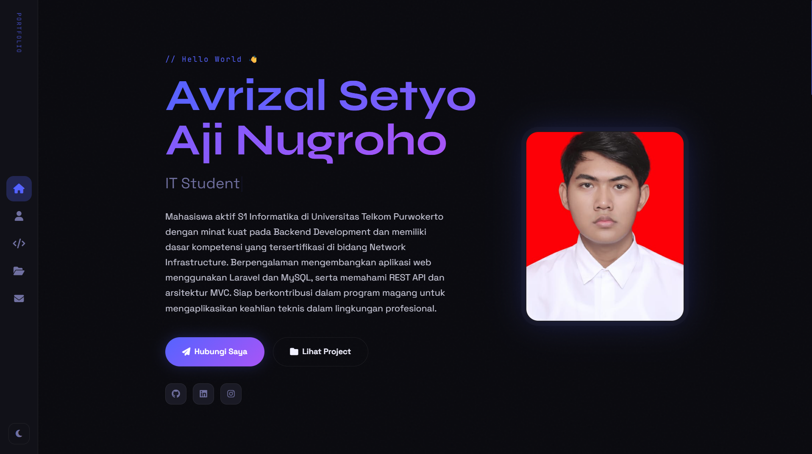

# About

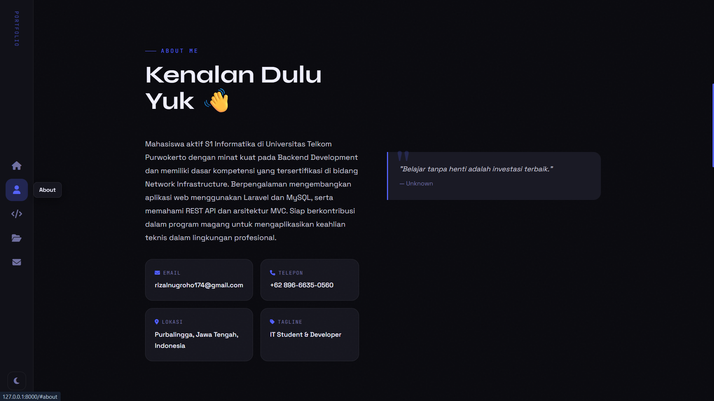

# Skill

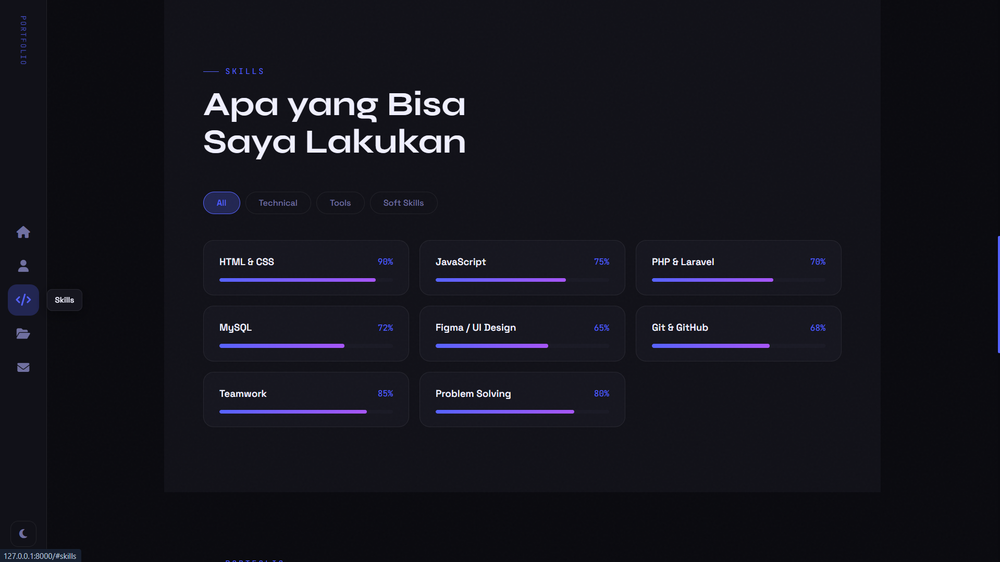

# Project

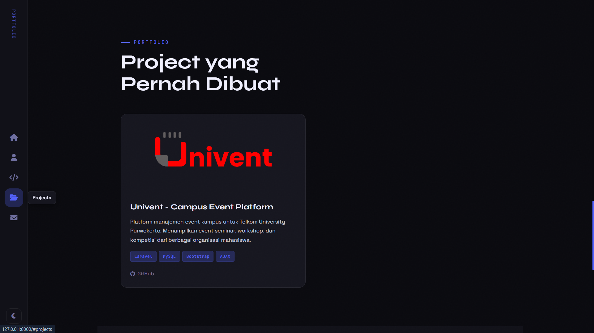

# Contact

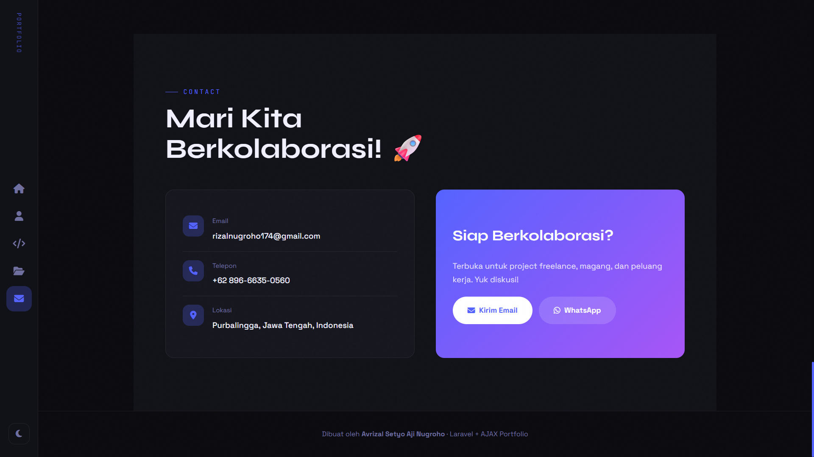

---

### 3.2 Halaman Admin

Halaman pusat kendali terproteksi yang memungkinkan admin mengelola seluruh konten portfolio secara real-time. Bagian ini mencakup sistem autentikasi keamanan, dasbor statistik, serta berbagai formulir interaktif untuk melakukan operasi CRUD (Create, Read, Update, Delete) pada data profil, skill, dan project.

Akses Jalur Admin:
Seluruh fitur pengelolaan ini berada di bawah rute terproteksi yang hanya dapat diakses melalui URL spesifik: http://127.0.0.1:8000/admin/login. Penggunaan rute ini bertujuan untuk memisahkan lalu lintas pengunjung umum dengan hak akses administrator, serta memastikan bahwa setiap perubahan data harus melewati validasi middleware autentikasi yang ketat.

# Login

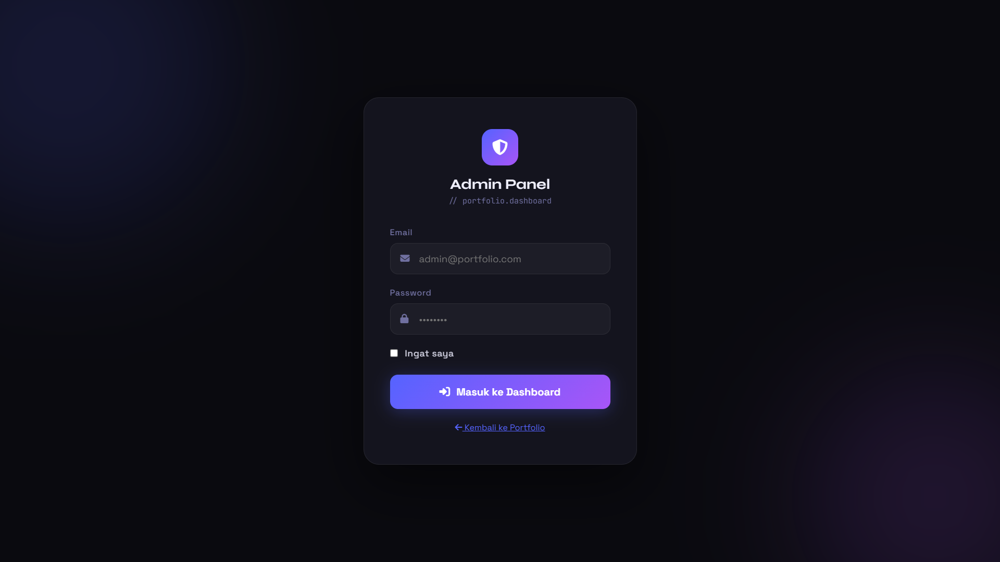

# Dashboard

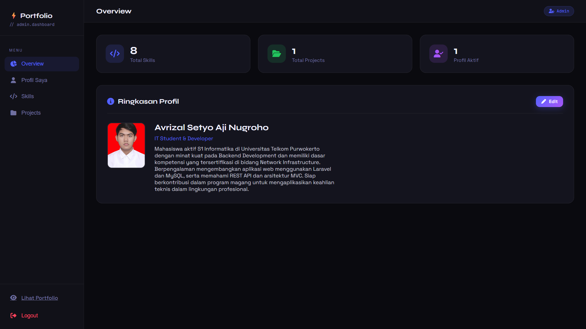

# profile dan edit

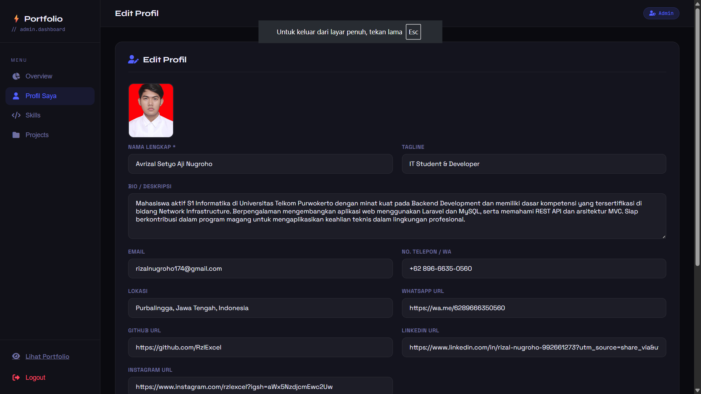

# Skill admin

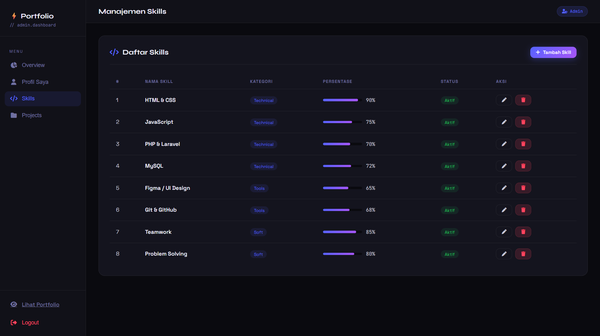

# tambah dan edit Skill admin

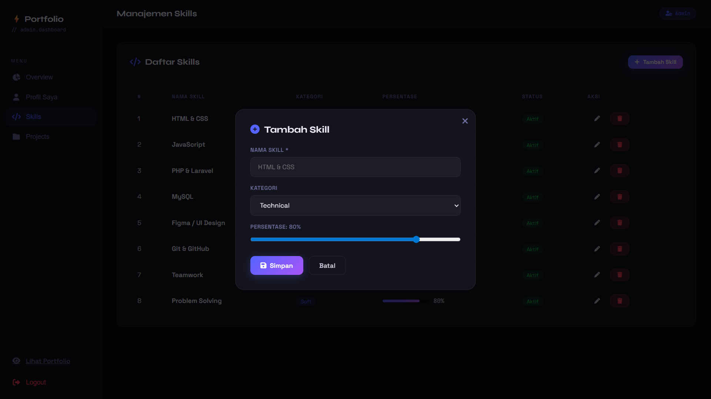

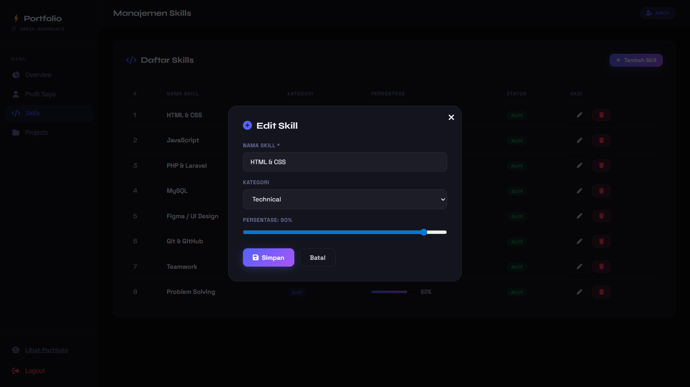

# Project admin

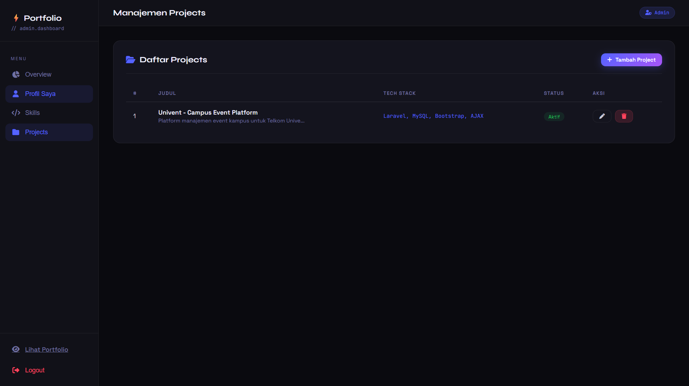

# tambah dan edit project admin

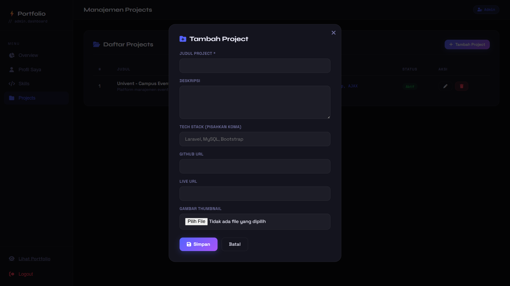

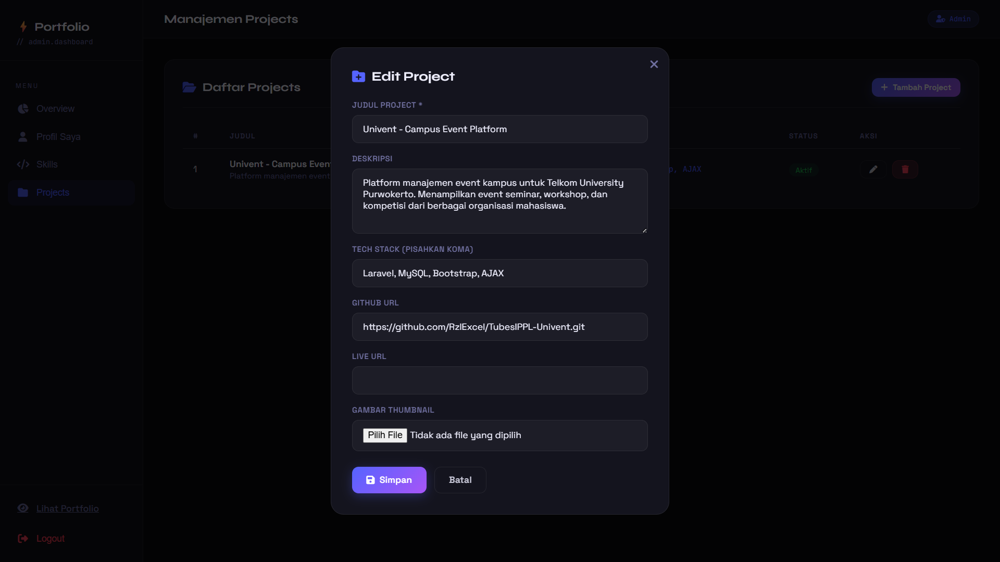

---

## 4. Referensi

- **Laravel Documentation**: [https://laravel.com/docs](https://laravel.com/docs)
- **Eloquent ORM**: [https://laravel.com/docs/eloquent](https://laravel.com/docs/eloquent)
- **Laravel Blade Templates**: [https://laravel.com/docs/blade](https://laravel.com/docs/blade)
- **Laravel Resource Controllers**: [https://laravel.com/docs/controllers#resource-controllers](https://laravel.com/docs/controllers#resource-controllers)
- **JavaScript Fetch API**: [https://developer.mozilla.org/en-US/docs/Web/API/Fetch_API](https://developer.mozilla.org/en-US/docs/Web/API/Fetch_API)
- **Google Fonts**: [https://fonts.google.com/](https://fonts.google.com/)
- **Font Awesome**: [https://fontawesome.com/icons](https://fontawesome.com/icons)
