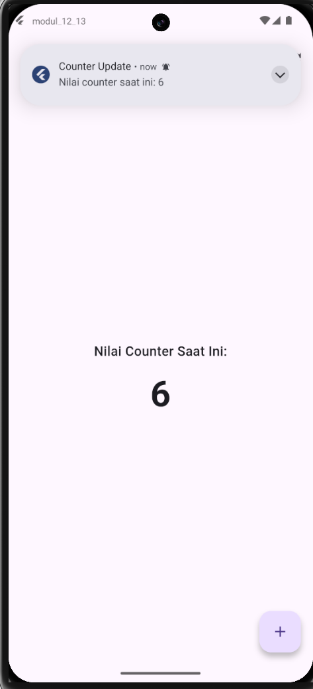
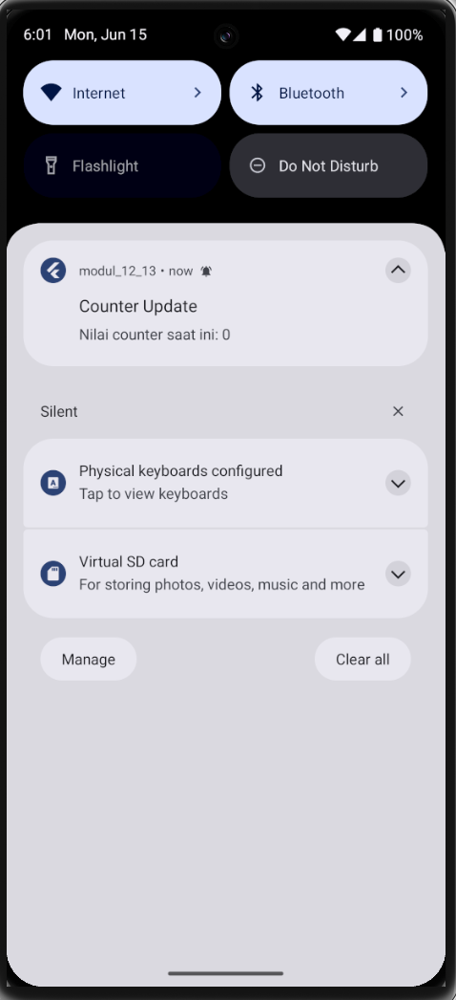

<div align="center">
  <br />
  <h1>LAPORAN PRAKTIKUM</h1>
  <h2>APLIKASI BERBASIS PLATFORM</h2>
  <br />
  <h3>Flutter Modul12&13</h3>
  <h3>Implementasi Provider dan Notifikasi pada Flutter</h3>
  <br />
  <br />
  
  <br />
  <br />
  <h3>Disusun Oleh :</h3>
  <p>
    <strong>AVRIZAL SETYO AJI NUGROHO</strong><br>
    <strong>2311102145</strong><br>
    <strong>S1 IF-11-REG01</strong>
  </p>
  <br />
  <h3>Dosen Pengampu :</h3>
  <p>
    <strong>Dimas Fanny Hebrasianto Permadi, S.ST., M.Kom</strong>
  </p>
  <br />
  <h4>Asisten Praktikum :</h4>
  <p>
    <strong>Apri Pandu Wicaksono</strong><br>
    <strong>Rangga Pradarrell Fathi</strong>
  </p>
  <br />
  <h3>
    LABORATORIUM HIGH PERFORMANCE<br>
    FAKULTAS INFORMATIKA<br>
    UNIVERSITAS TELKOM PURWOKERTO<br>
    2026
  </h3>
</div>

---

## 1. Dasar Teori

### 1.1 Flutter
Flutter adalah framework UI open-source yang dikembangkan oleh Google untuk membangun aplikasi mobile, web, dan desktop dari satu basis kode (*codebase*) menggunakan bahasa pemrograman Dart. Flutter bekerja dengan cara merender setiap piksel di layar secara langsung menggunakan mesin grafis Skia/Impeller, sehingga menghasilkan tampilan yang konsisten di berbagai platform. Komponen dasar dalam Flutter disebut **widget**, di mana seluruh elemen UI dibangun dari kombinasi widget yang bersifat deklaratif dan dapat di-*compose*.

### 1.2 State Management dalam Flutter
State adalah data yang dapat berubah selama siklus hidup aplikasi berjalan dan memengaruhi tampilan UI. Flutter membagi state menjadi dua jenis:

- **Ephemeral State (Local State)**: State yang hanya relevan di dalam satu widget dan dikelola secara lokal menggunakan `setState()` pada `StatefulWidget`.
- **App State (Shared/Global State)**: State yang perlu dibagikan dan diakses oleh banyak widget di berbagai bagian widget tree. Pengelolaan *app state* memerlukan pendekatan yang lebih terstruktur, salah satunya menggunakan **Provider**.

### 1.3 Provider
**Provider** adalah package state management yang direkomendasikan secara resmi oleh tim Flutter. Provider merupakan *wrapper* di atas `InheritedWidget` yang menyederhanakan cara mendistribusikan dan mengonsumsi data di seluruh widget tree tanpa harus meneruskan data secara manual melalui konstruktor (*prop drilling*).

Komponen-komponen utama dalam Provider:

| Komponen | Fungsi |
|---|---|
| `ChangeNotifier` | Kelas yang menjadi *model* data. Menyediakan metode `notifyListeners()` untuk memberi tahu semua widget yang mendengarkan bahwa state telah berubah. |
| `ChangeNotifierProvider` | Widget yang menyediakan (*provide*) instance `ChangeNotifier` ke seluruh widget di bawahnya dalam widget tree. Diletakkan di atas widget tree agar dapat diakses secara global. |
| `Consumer<T>` | Widget yang *subscribe* (mendengarkan) perubahan pada `ChangeNotifier` bertipe `T`. Widget ini akan secara otomatis dibangun ulang (*rebuild*) setiap kali `notifyListeners()` dipanggil. |
| `Provider.of<T>(context, listen: false)` | Cara mengakses instance Provider dari `context` tanpa menyebabkan widget ikut di-*rebuild*. Parameter `listen: false` umumnya digunakan saat hanya memanggil method (aksi), bukan membaca data. |

### 1.4 Local Notification
**Local Notification** adalah notifikasi yang ditampilkan langsung oleh aplikasi di perangkat pengguna tanpa memerlukan koneksi internet maupun server eksternal. Berbeda dengan *push notification* yang dikirim dari server, local notification dibangkitkan sepenuhnya dari sisi klien (aplikasi).

Package **`flutter_local_notifications`** adalah plugin Flutter yang menyediakan API lintas platform untuk menampilkan notifikasi lokal pada Android, iOS, dan macOS. Fitur utamanya meliputi:
- Menampilkan notifikasi dengan judul (*title*) dan isi pesan (*body*).
- Konfigurasi **Notification Channel** untuk Android 8.0 (API level 26) ke atas.
- Pengaturan tingkat importance dan priority notifikasi.
- Permintaan izin (*permission*) notifikasi, wajib pada Android 13 (API level 33) ke atas.

### 1.5 Notification Channel (Android)
Sejak Android 8.0 (Oreo, API level 26), setiap notifikasi **wajib** dikaitkan dengan sebuah **Notification Channel**. Channel adalah kategori notifikasi yang dapat dikonfigurasi oleh pengguna melalui pengaturan sistem, misalnya untuk menonaktifkan suara atau getaran dari kategori tertentu. Setiap channel diidentifikasi dengan `channelId` yang unik dan memiliki atribut seperti `importance`, `sound`, `vibration`, dan `description`.

---

## 2. Kode
*notification_service.dart*
```dart
import 'package:flutter_local_notifications/flutter_local_notifications.dart';

class NotificationService {
  static final FlutterLocalNotificationsPlugin _notificationsPlugin =
      FlutterLocalNotificationsPlugin();

  // Inisialisasi Layanan Notifikasi
  static Future<void> init() async {
    const AndroidInitializationSettings initializationSettingsAndroid =
        AndroidInitializationSettings('@mipmap/ic_launcher');

    const InitializationSettings initializationSettings =
        InitializationSettings(android: initializationSettingsAndroid);

    // Meminta izin notifikasi untuk Android 13 ke atas
    await _notificationsPlugin
        .resolvePlatformSpecificImplementation<
          AndroidFlutterLocalNotificationsPlugin
        >()
        ?.requestNotificationsPermission();

    await _notificationsPlugin.initialize(initializationSettings);
  }

  // Fungsi untuk Menampilkan Notifikasi
  static Future<void> showNotification(int counterValue) async {
    const AndroidNotificationDetails androidPlatformChannelSpecifics =
        AndroidNotificationDetails(
          'counter_channel_id',
          'Counter Updates',
          channelDescription:
              'Channel untuk notifikasi perubahan nilai counter',
          importance: Importance.max,
          priority: Priority.high,
        );

    const NotificationDetails platformChannelSpecifics = NotificationDetails(
      android: androidPlatformChannelSpecifics,
    );

    await _notificationsPlugin.show(
      0,
      'Counter Update',
      'Nilai counter saat ini: $counterValue',
      platformChannelSpecifics,
    );
  }
}
```

*counter_provider.dart*
```dart
import 'package:flutter/material.dart';
import 'notification_service.dart';

class CounterProvider with ChangeNotifier {
  int _count = 0;

  int get count => _count;

  void increment() {
    _count++;
    notifyListeners(); // Memberitahu UI untuk memperbarui tampilan

    // Memicu local notification saat nilai bertambah
    NotificationService.showNotification(_count);
  }

  void reset() {
    _count = 0;
    notifyListeners(); // Refresh UI angka menjadi 0

    // Kirim notifikasi bahwa counter telah di-reset
    NotificationService.showNotification(_count);
  }
}

```

*main.dart*
```dart
import 'package:flutter/material.dart';
import 'package:provider/provider.dart';
import 'counter_provider.dart';
import 'notification_service.dart';

// Nama : Avrizal Setyo Aji Nugroho
// NIM  : 2311102145
void main() async {
  // Memastikan binding Flutter siap sebelum inisialisasi async
  WidgetsFlutterBinding.ensureInitialized();
  await NotificationService.init();

  runApp(
    // Membungkus aplikasi dengan ChangeNotifierProvider
    ChangeNotifierProvider(
      create: (context) => CounterProvider(),
      child: const MyApp(),
    ),
  );
}

class MyApp extends StatelessWidget {
  const MyApp({super.key});

  @override
  Widget build(BuildContext context) {
    return MaterialApp(
      debugShowCheckedModeBanner: false,
      title: 'Praktik Modul 12 & 13',
      theme: ThemeData(primarySwatch: Colors.blue),
      home: const CounterScreen(),
    );
  }
}

class CounterScreen extends StatelessWidget {
  const CounterScreen({super.key});

  @override
  Widget build(BuildContext context) {
    return Scaffold(
      appBar: AppBar(
        title: const Text('Provider & Local Notification'),
        centerTitle: true,
        // TAMBAHKAN TOMBOL RESET DI SINI
        actions: [
          IconButton(
            icon: const Icon(Icons.refresh),
            tooltip: 'Reset Counter',
            onPressed: () {
              // Memanggil fungsi reset
              Provider.of<CounterProvider>(context, listen: false).reset();
            },
          ),
        ],
      ),
      body: Center(
        child: Column(
          mainAxisAlignment: MainAxisAlignment.center,
          children: [
            const Text(
              'Nilai Counter Saat Ini:',
              style: TextStyle(fontSize: 18, fontWeight: FontWeight.w500),
            ),
            const SizedBox(height: 10),
            Consumer<CounterProvider>(
              builder: (context, counterProvider, child) {
                return Text(
                  '${counterProvider.count}',
                  style: const TextStyle(
                    fontSize: 48,
                    fontWeight: FontWeight.bold,
                  ),
                );
              },
            ),
          ],
        ),
      ),
      floatingActionButton: FloatingActionButton(
        onPressed: () {
          Provider.of<CounterProvider>(context, listen: false).increment();
        },
        tooltip: 'Tambah Nilai',
        child: const Icon(Icons.add),
      ),
    );
  }
}

```
*Tambahkan library provider dan flutter_local_notifications pada bagian dependencies:*
```yml
dependencies:
  flutter:
    sdk: flutter
  provider: ^6.1.2
  flutter_local_notifications: ^17.0.0

```


### Penjelasan

#### `notification_service.dart`
File ini mendefinisikan kelas `NotificationService` yang bertugas mengelola seluruh logika notifikasi lokal. Kelas ini dirancang menggunakan *static methods* agar dapat dipanggil dari mana saja tanpa perlu membuat instance terlebih dahulu.

- **`_notificationsPlugin`**: Instance statis dari `FlutterLocalNotificationsPlugin` yang merupakan titik masuk utama untuk semua operasi notifikasi.
- **`init()`**: Method inisialisasi yang dipanggil sekali saat aplikasi pertama kali berjalan. Di dalamnya dikonfigurasi ikon launcher sebagai ikon default notifikasi Android (`@mipmap/ic_launcher`), kemudian meminta izin notifikasi ke sistem operasi (khusus Android 13 ke atas), dan terakhir menginisialisasi plugin dengan pengaturan tersebut.
- **`showNotification(int counterValue)`**: Method untuk menampilkan notifikasi. Method ini mendefinisikan `AndroidNotificationDetails` dengan channel ID `'counter_channel_id'`, nama channel `'Counter Updates'`, serta tingkat `importance: Importance.max` dan `priority: Priority.high` agar notifikasi langsung muncul sebagai *heads-up notification*. Notifikasi ditampilkan menggunakan `_notificationsPlugin.show()` dengan ID tetap `0`, sehingga setiap notifikasi baru akan menimpa (*replace*) notifikasi sebelumnya, bukan menumpuk.

#### `counter_provider.dart`
File ini mendefinisikan kelas `CounterProvider` yang berfungsi sebagai *model* data sekaligus sumber kebenaran tunggal (*single source of truth*) untuk nilai counter dalam aplikasi.

- **`with ChangeNotifier`**: `CounterProvider` menggunakan *mixin* `ChangeNotifier` sehingga mendapatkan kemampuan untuk memberi tahu widget yang mendengarkannya ketika terjadi perubahan state.
- **`_count`**: Variabel *private* bertipe `int` yang menyimpan nilai counter saat ini, diinisialisasi dengan nilai `0`.
- **`int get count`**: *Getter* publik yang mengekspos nilai `_count` secara *read-only* kepada widget. Hal ini menjaga enkapsulasi agar state tidak dapat diubah langsung dari luar kelas.
- **`increment()`**: Menambah nilai `_count` sebesar 1, kemudian memanggil `notifyListeners()` agar semua widget `Consumer` yang terhubung melakukan *rebuild* dengan data terbaru, lalu memicu `NotificationService.showNotification()` untuk menampilkan notifikasi dengan nilai counter yang baru.
- **`reset()`**: Mengatur ulang `_count` kembali ke `0`, kemudian sama seperti `increment()`, memanggil `notifyListeners()` dan menampilkan notifikasi yang menginformasikan bahwa counter telah direset.

#### `main.dart`
File ini merupakan entry point aplikasi Flutter yang mengintegrasikan Provider dan Notification Service ke dalam satu kesatuan aplikasi.

- **`WidgetsFlutterBinding.ensureInitialized()`**: Memastikan binding antara Flutter engine dan framework telah siap sebelum menjalankan kode async (seperti inisialisasi notifikasi). Pemanggilan ini wajib dilakukan jika terdapat operasi async sebelum `runApp()`.
- **`await NotificationService.init()`**: Menginisialisasi layanan notifikasi secara async sebelum aplikasi dimulai.
- **`ChangeNotifierProvider`**: Membungkus seluruh aplikasi (`MyApp`) agar `CounterProvider` dapat diakses oleh semua widget di bawahnya dalam widget tree. Parameter `create` menerima *factory function* yang membuat instance `CounterProvider`.
- **`MyApp`**: `StatelessWidget` yang mendefinisikan konfigurasi `MaterialApp`, termasuk tema dan halaman awal (`CounterScreen`).
- **`CounterScreen`**: Halaman utama yang menggunakan `StatelessWidget`. Tombol reset pada `AppBar` menggunakan `Provider.of<CounterProvider>(context, listen: false).reset()` karena hanya memanggil aksi tanpa perlu *rebuild*. Widget `Consumer<CounterProvider>` digunakan untuk menampilkan nilai counter secara reaktif — hanya bagian `Text` yang menampilkan angka saja yang di-*rebuild* ketika state berubah, bukan seluruh halaman. `FloatingActionButton` memanggil `increment()` dengan cara yang sama seperti tombol reset.

#### `pubspec.yaml`
Dua *dependency* utama yang ditambahkan:
- **`provider: ^6.1.2`**: Package state management untuk mengelola dan mendistribusikan state `CounterProvider` di seluruh widget tree.
- **`flutter_local_notifications: ^17.0.0`**: Package untuk menampilkan notifikasi lokal pada perangkat Android (dan platform lain).

---

## 3. Screenshot Hasil
**Penambahan Nilai Counter**



**Reset Counter**


**Notifikasi pada Bilah Notifikasi**



---

## 4. Referensi

- Dart: [https://dart.dev](https://dart.dev)
- Flutter Docs: [https://docs.flutter.dev](https://docs.flutter.dev)
